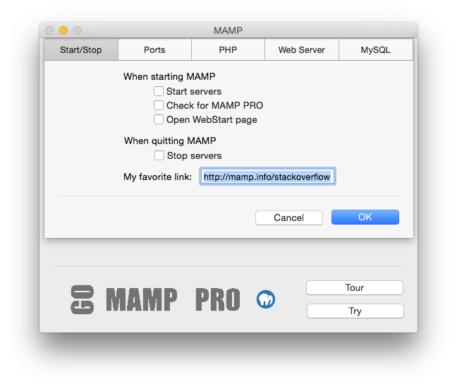
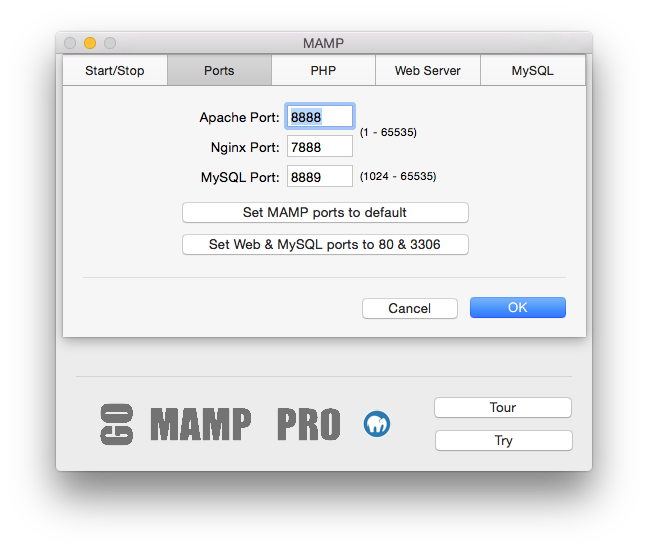
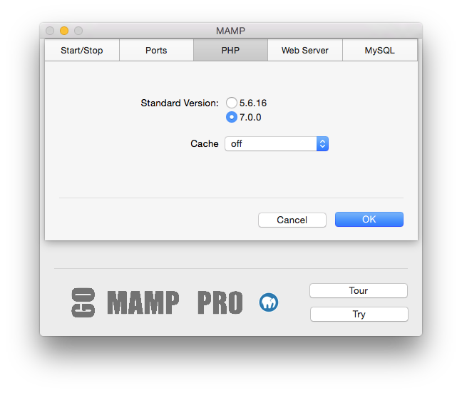
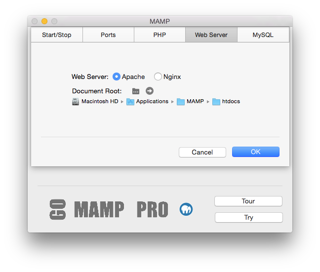

## Einstellungen

### Start/Stopp

*   **Starte Server**  
   Die Serverdienste werden beim Öffnen von MAMP automatisch gestartet.
*   **Nach MAMP PRO suchen**  
   Sie werden gefragt, ob Sie MAMP oder MAMP PRO öffnen möchten.
*   **Webstart öffnen**  
   Beim Starten von MAMP wird die Webstartseite automatisch geöffnet. Im Abschnitt Webstartseite öffnen erhalten Sie weitere    Information über die MAMP-Webstartseite.
*   **Stoppe Server**  
   Die Serverdienste werden beim Beenden von MAMP automatisch gestoppt.
*   **My Favorite Link**  
   A link to this address will appear on the top menu of your Webstart page.

### Ports

Server-Programme die über das Netzwerk angesprochen werden, müssen einem bestimmten Netzwerk-Port zugeordnet sein. Dadurch können mehrere unterschiedliche Server-Programme auf einem Rechner gleichzeitig betrieben werden. Für jeden Dienst gibt es einen Standard-Port. Ein Webserver nutzt in der Regel Port 80, der MySQL-Datenbankserver Port 3306.

Diese Ports sind frei wählbar. Die Standardeinstellung von MAMP nutzt die Ports 8888, 7888 und 8889. So können Sie auf Ihrem Rechner neben MAMP noch weitere Server betreiben. Sollten die Ports 8888, 7888 und 8889 bereits von anderen Programmen auf ihrem Rechner benutzt werden, ändern Sie die Port-Einstellungen entsprechend.

Mit dem Button Apache- & MySQL Ports auf 80 & 3306 setzen stellen die Einstellungen auf die im Internet üblichen Werte ein. Mit Ports auf MAMP-Voreinstellung setzen stellen Sie die Ports für Apache und MySQL auf 8888 und 8889 zurück.

Soll MAMP auch von außen über das Internet erreichbar sein, so achten Sie bitte darauf, dass die hier konfigurierten Ports auch in Ihrer Firewall geöffnet sind.

### PHP

*   **Standardversion**  
   Legen Sie fest, ob PHP in der Version 5.5.18 oder 5.6.2 verwendet werden soll. Die exakte Versionsnummer hängt von der       installierten MAMP-Version ab.
*   **Cache**  
   Wählen Sie eine PHP-Caching Option. Caching kann die Ausführung von PHP-Code beschleunigen. Die Standard-Caching-Option      ist aus. OPcache funktioniert nur mit PHP 5.5.x, eAccelerator nur mit PHP-Versionen vor 5.5.

### WebServer

*   **Web Server**
   Choose either the Apache or Nginx web server.
*   **Document Root** 
   Click on  to select where your html/PHP files and images are stored. This directory is called Document Root. The default     Document Root in MAMP is: `/Applications/MAMP/htdocs`.

### Open WebStart Page

The default MAMP start page provides links to access utilities such as phpMyAdmin, phpInfo, SQLite Manager, phpLiteAdmin, FAQ, MyFavoriteLink and the MAMP Website.

When the My Favorite Link text box is filled in, a link will appear at the top of the MAMP start page with the title 'My Favorite Link'. The My Favorite Link page can be changed using Preferences…. When using the default setting (`/MAMP/`), you will be directed to the MAMP utilities start page using the Alias  definition `/MAMP/`.

If this field is left blank, you will be taken to your default document root (http://localhost:8888 in the `/Applications/MAMP/htdocs`). If you enter /subDirectory in this field, you will be taken to the `/Applications/MAMP/htdocs/subDirectory` folder via your default web browser (http://localhost:8888/subDirectory).

