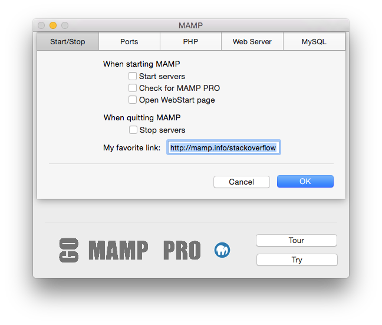
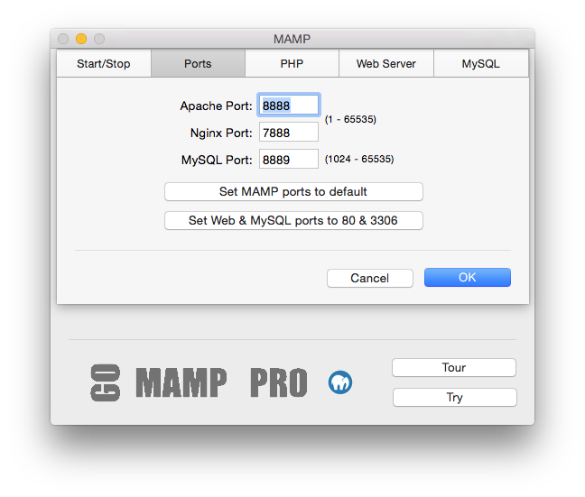
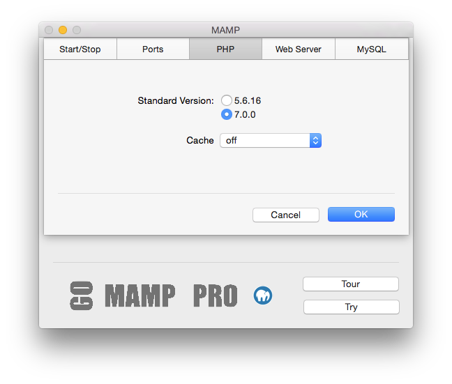
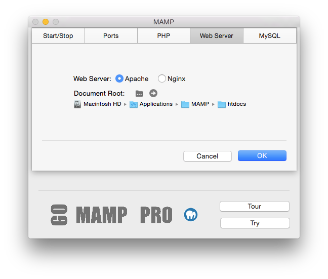
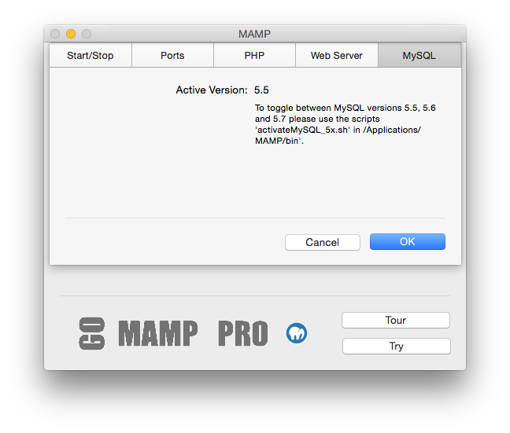

## Einstellungen

### Start/Stopp

*   **Starte Server**  
   Die Serverdienste werden beim Öffnen von MAMP automatisch gestartet.
*   **Nach MAMP PRO suchen**  
   Sie werden gefragt, ob Sie MAMP oder MAMP PRO öffnen möchten.
*   **Webstart öffnen**  
   Beim Starten von MAMP wird die Webstartseite automatisch geöffnet. Im Abschnitt Webstartseite öffnen erhalten Sie weitere    Information über die MAMP-Webstartseite.
*   **Stoppe Server**  
   Die Serverdienste werden beim Beenden von MAMP automatisch gestoppt.
*   **My Favorite Link**  
   A link to this address will appear on the top menu of your Webstart page.

---

### Ports

Server-Programme die über das Netzwerk angesprochen werden, müssen einem bestimmten Netzwerk-Port zugeordnet sein. Dadurch können mehrere unterschiedliche Server-Programme auf einem Rechner gleichzeitig betrieben werden. Für jeden Dienst gibt es einen Standard-Port. Ein Webserver nutzt in der Regel Port 80, der MySQL-Datenbankserver Port 3306.

Diese Ports sind frei wählbar. Die Standardeinstellung von MAMP nutzt die Ports 8888, 7888 und 8889. So können Sie auf Ihrem Rechner neben MAMP noch weitere Server betreiben. Sollten die Ports 8888, 7888 und 8889 bereits von anderen Programmen auf ihrem Rechner benutzt werden, ändern Sie die Port-Einstellungen entsprechend.

Mit dem Button Apache- & MySQL Ports auf 80 & 3306 setzen stellen die Einstellungen auf die im Internet üblichen Werte ein. Mit Ports auf MAMP-Voreinstellung setzen stellen Sie die Ports für Apache und MySQL auf 8888 und 8889 zurück.

Soll MAMP auch von außen über das Internet erreichbar sein, so achten Sie bitte darauf, dass die hier konfigurierten Ports auch in Ihrer Firewall geöffnet sind.

---

### PHP

*   **Standardversion**  
   Legen Sie fest, ob PHP in der Version 5.5.18 oder 5.6.2 verwendet werden soll. Die exakte Versionsnummer hängt von der       installierten MAMP-Version ab.
*   **Cache**  
   Wählen Sie eine PHP-Caching Option. Caching kann die Ausführung von PHP-Code beschleunigen. Die Standard-Caching-Option      ist aus. OPcache funktioniert nur mit PHP 5.5.x, eAccelerator nur mit PHP-Versionen vor 5.5.

---

### WebServer

*   **Webserver**
   Apache oder Nginx web server wahlen.
*   **Document Root** 
   Das Verzeichnis, welches Ihrer Webseiten enthält, heißt Document Root oder Stammverzeichnis. Nach der Installation lautet    es: /Programme/MAMP/htdocs. Klicken Sie auf  um es auf einen anderen Ordner festzulegen.

---

### MySQL

The MySQL database server is a popular database used on production servers. Several installations of MySQL are installed on your computer by MAMP.

*   **Upgrading**  
    To upgrade your MySQL for MAMP you need to shut down your servers (maybe). Upgrade your MySQL by dragging                    /Applications/MAMP/bin/activateMySQL_5xx.sh from your Finder window into a Terminal window and pressing Enter.

   Alternitavely you can open a terminal and type the following. You will be upgraded to MySQL 5.6. 

   `/Applications/MAMP/bin/./activateMySQL_56.sh`

   

   Data you have entered using MySQL 5.6 or 5.7 cannot be transitioned back to 5.5.
   

*   **Reverting**  
    Reverting the MySQL software back to 5.5.x is easy, just re-install MAMP and MAMP PRO. Data you have entered using MySQL 5.6 will not be transitioned back to 5.5.

---

### Webstartseite öffnen

Die Standard-Webstartseite enthält Links zu phpMyAdmin, phpInfo, SQLite Manager, phpLiteAdmin, Mein Leiblings-Link, zur FAQ und zur MAMP Webseite.

Die Startseite kann unter Einstellungen... geändert werden. Bei Verwendung der Standard-Einstellung (/MAMP/) werden Sie auf die (Utilities) MAMP-Startseite geleitet.

Ist dieses Feld leer, dann gelangen Sie im Webbrowser auf Ihr Stammverzeichnis (http://localhost:8888).

Geben Sie ein /Unterverzeichnis in dieses Feld ein, dann ruft der Webbrowser http://localhost:8888/Unterverzeichnis auf, was den Inhalt von <Document Root>/Unterverzeichnis anzeigt.
