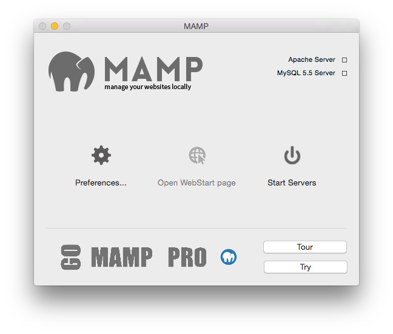

## Erste Schritte

Nach erfolgreicher Installation können Sie den lokalen Webserver starten. Starten Sie dazu die Anwendung MAMP und klicken Sie auf den Button Server starten. In der Statusanzeige auf der rechten Seite wird angezeigt, ob der Server erfolgreich gestartet wurde. Falls nötig, werden Sie an dieser Stelle nach Ihrem Administrator-Kennwort gefragt.

Der Webserver (Apache) wird standardmäßig auf Port 8888 betrieben, der Datenbankserver (MySQL) auf Port 8889. Wenn Sie Ihre lokale Webseite im Browser öffnen möchten, müssen Sie am Ende der URL den Apache-Port angeben: http://localhost:8888

*   **Einstellungen…**  
    Hier legen Sie die Einstellungen von MAMP fest. Siehe Abschnitt Einstellungen für weitere Details.

*   **Webstart öffnen**  
    Hier öffnen Sie die Startseite Ihres lokalen Webservers.

*   **Server starten / Server beenden**  
    Starten oder stoppen Sie hier die MAMP-Serverdienste.

