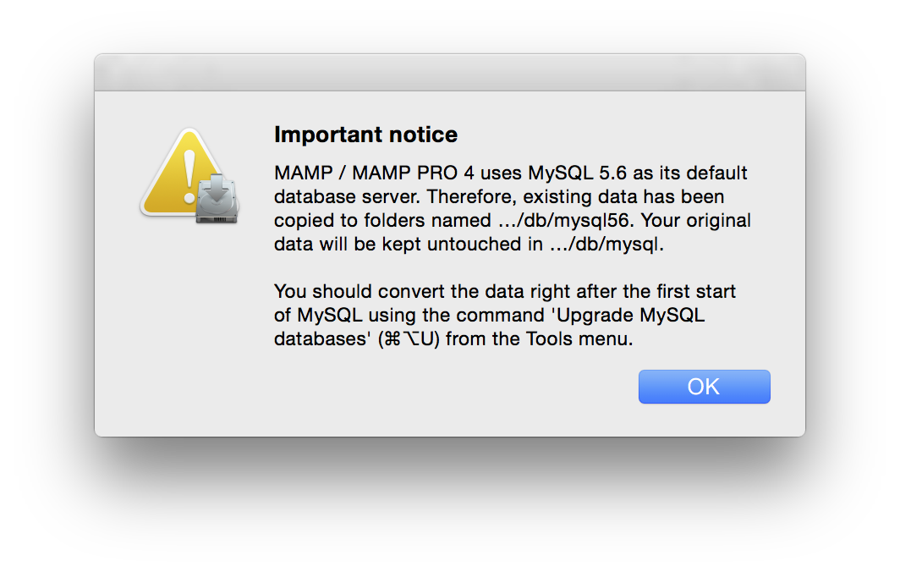
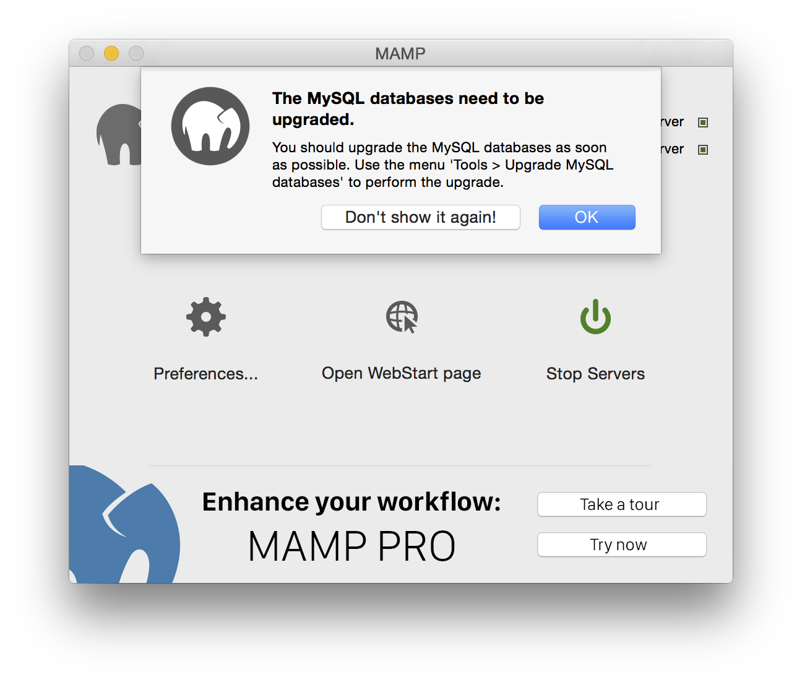
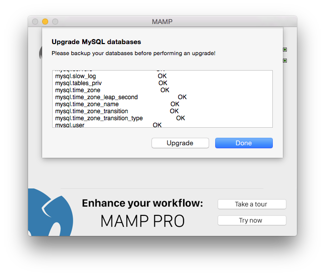

## Installation

### Installation Requirements

To use the MAMP, your system must meet the following requirements:

- Operating system: Apple OS X 10.10.5 or later
- Mac with 64-Bit CPU from Intel (x84)
- User account that allows to administer the computer (Administrator)

---

### New Installation

1. Download MAMP PRO from [www.mamp.info](https://www.mamp.info){:target="_blank"} .
2. Double click on the file `MAMP_MAMP_PRO_4.0.pkg` in your Downloads folder.
3. The System Installer will guide you through the installation process.

Note: You need administrator permissions to install MAMP!

When installing MAMP, an `/Applications/MAMP PRO` folder will be installed in addition to your `/Applications/MAMP` folder. You can ignore this folder if you choose not use MAMP PRO.

---

### Upgrade From MAMP 3

You should backup your database data before upgrading from MAMP 3 to MAMP 4. Your database data is located in  `/Applications/MAMP/db`

1. Download MAMP PRO from [www.mamp.info](https://www.mamp.info){:target="_blank"} .
2. Double click on the file `MAMP_MAMP_PRO_4.0.pkg` in your Downloads folder.
3. The System Installer will guide you through the installation process.
4. The installer will rename its `MAMP` folder to `MAMP_current_date`.
5. Your existing "htdocs" folder will be moved to your new `/Applications/MAMP` folder.
6. If you have not previously upgraded your database files to MySQL 5.6 you will receive a notification reminding you to upgrade. It is recommended that you upgrade your database data to MySQL 5.6 when you start your servers in MAMP.

Confirm that all data has been transferred correctly before starting MAMP. Your `/Applications/MAMP_current_date` folder can now be deleted. You may however keep it, so you can fall back to your original setup.

---

### Upgrading Your Database Data

When you first start your servers in MAMP you will be asked to upgrade your database data.

Press Upgrade to upgrade your database data.

---

### Uninstall

To uninstall MAMP, you only have to delete the MAMP directory and everything returns to the original state (MAMP does not alter anything on the normal Mac OS X).

If you have used MAMP PRO as well, use the MAMP PRO uninstaller in the `/Applications/MAMP PRO` folder to remove it.

