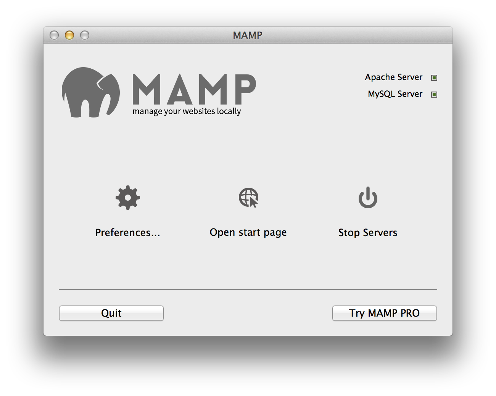

## Was ist MAMP ? 

MAMP is a one-click-solution for setting up your personal webserver. MAMP installs a local server environment in a matter of seconds on your computer. It comes free of charge, and is easily installed.

- [Installation](Installation/)  
- [Erste Schritte](Erste Schritte/)  
- [Einstellungen](Einstellungen/)
- [Anleitungen](Anleitungen/)  
- [FAQ](FAQ/)  
