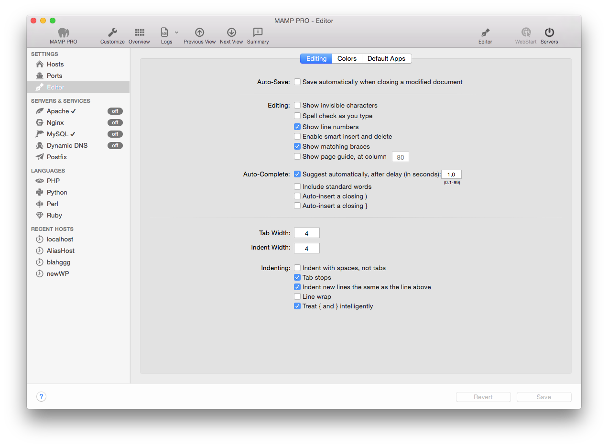
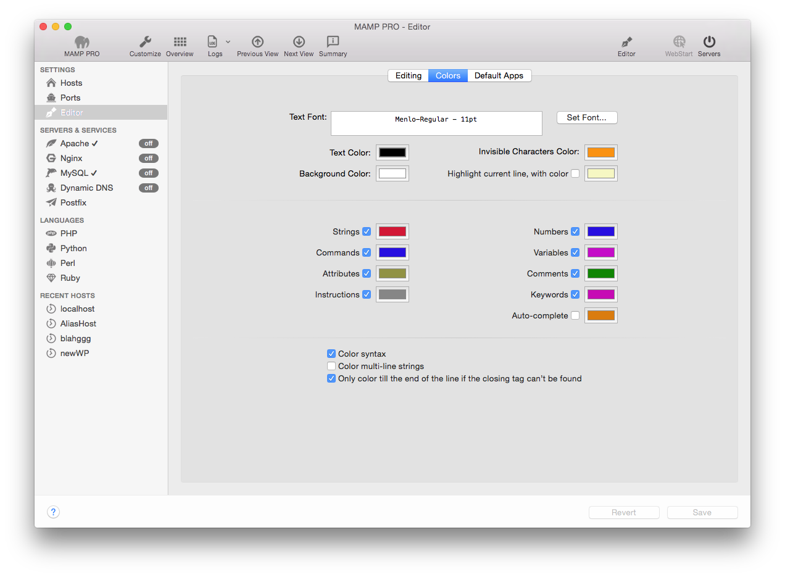
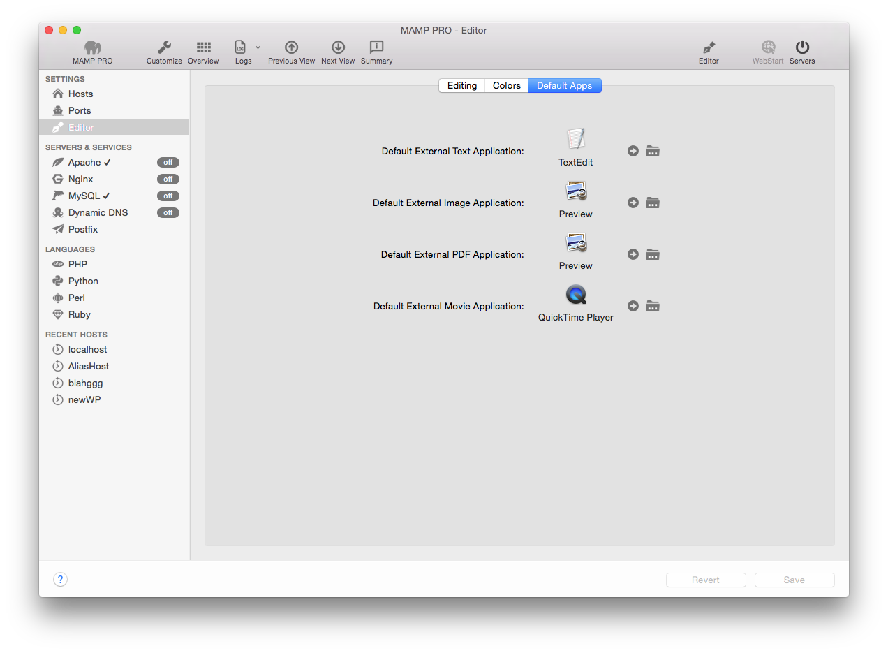

## Editor

### Editieren

*  **Auto-Save:**  
    *  **Save automatically when closing a modified document**

---

*  **Editing:**  
    *  **Show invisible characters**
    *  **Spell check as you type**
    *  **Show lines numbers**
    *  **Enable smart insert and delete**
    *  **Show matching braces**
    *  **Show page guide, at column**

---

*  **Auto-Complete:**  
    *  **Suggest automatically, after delay (in seconds)**  
    *  **Include standard words**  
    *  **Auto-insert a closing )**  
    *  **Auto-insert a closing }**  

---

*  **Tab Width**  

*  **Indent Width** 
*  **Indenting**  
    *  **Indent with spaces, not tabs**  
    *  **Tab stops**  
    *  **Indent new lines the same as the line above**  
    *  **Line wrap**  
    *  **Treat { and } intelligently**  

---

### Farben

---

### Externe Apps

