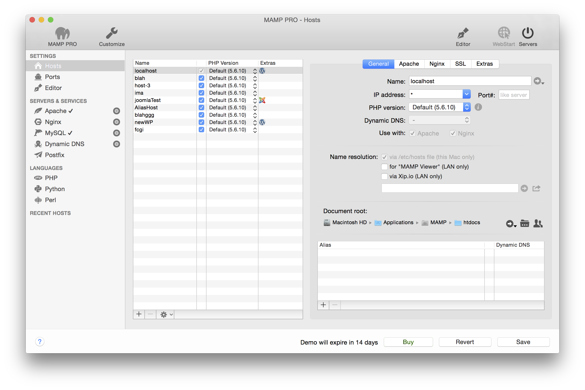
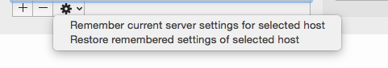
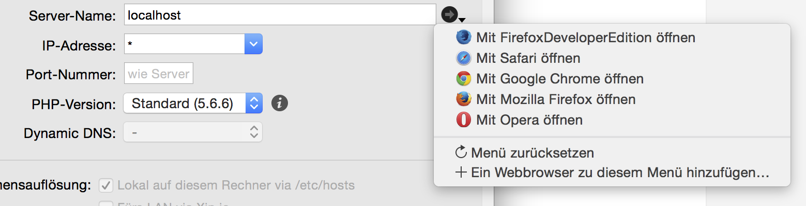
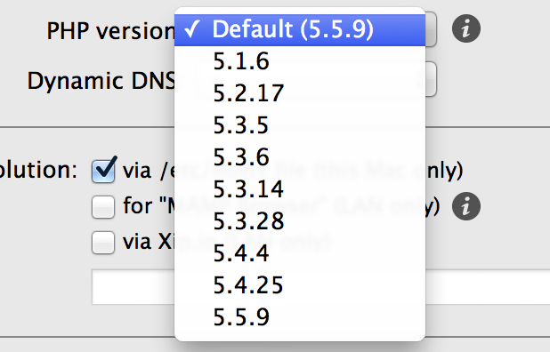

## Einstellungen > Hosts > Allgemein

MAMP PRO verwendet virtuelle Hosts. Mit diesen kann Apache mehrere, unterschiedliche Websites bereitstellen. Sie können eine unbegrenzte Anzahl an virtuellen Hosts erstellen - Sie können so für jedes Ihrer Projekte einen eigenen virtuellen Host anlegen.

Jeder virtuelle Host nutzt ein eigenes Stammverzeichnis zum Speichern seiner Dateien (z. B. html-, PHP-, oder Bilddateien).

Hinweis: Der virtuelle Host "localhost" wird standardmäßig erstellt und kann nicht gelöscht werden.
Der Name eines virtuellen Hosts (identifiziert durch den Server-Namen) muss eindeutig sein. Oft ist es praktisch, ein umgekehrtes Domain-Namensschema zu verwenden. Dies erleichtert Ihnen dessen Erkennung, etwa de.appsolute.mamp. Vermeiden Sie real existierende Domains (etwa mamp.appsolute.de), das führt zu Eindeutigkeitsproblemen.

Um einen Host anzulegen klicken Sie den Plus-Button unten links im Hauptfenster. Geben Sie einen Server-Namen an. Wählen Sie anschliessend ein Stammverzeichnis für Ihren neuen Host aus. Klicken Sie dazu auf das Ordnersymbol.

Klicken Sie auf den Rechtspfeil-Button, um den Ordner im Finder zu öffnen.

Das Stammverzeichnis wird auch als Document Root bezeichnet. Ist dieses Verzeichnis leer, legt MAMP PRO beim nächsten Start von Apache automatisch eine index.php-Datei und eine MAMP-Bilddatei dort ab.

When your host page is functioning or at any other time you can save your host settings so you can go back to them at a later date. This serves as a backup in the case you make some server changes and discover your site is no longer accessible.

*  **Server Name**  
Der Server-Name muss in Kombination mit der Portnummer eindeutig sein. Er darf nur Buchstaben, Zahlen und das Minuszeichen (-) enthalten. Das Minuszeichen (-) darf allerdings weder das erste noch das letzte Zeichen sein.

Zwischen Groß- und Kleinschreibung wird nicht unterschieden.

Bei laufendem Server öffnet ein Klick auf den Rechtspfeil-Button den entsprechenden Host in Ihrem Browser.

*  **IP-Adresse**  
Ist dieses Feld leer oder enthält einen Stern ‘*’, wird Apache eine der IP-Adressen des Computers verwenden, um auf diesen virtuellen Host zuzugreifen. Mit dem Pop-up Menu können Sie auswählen, welche IP-Adresse für die Verbindung mit dem virtuellen Host verwendet wird.

**Port Nummer**  
Legen Sie fest unter welchem Port der virtuelle Host erreichbar ist. Gültig sind Werte von 1 bis 65535. In den meisten Fällen müssen Sie hier keine Änderungen vornehmen.

*  **PHP-Version**  
Hier bestimmen Sie, welche PHP-Version ein virtueller Host verwendet. Standardmässig wird für jeden virtuellen Host die selbe PHP-Version benutzt. Welche Version dies ist, legen Sie im Bereich der PHP-Einstellungen (Reiter PHP) unter Standardversion fest.

Möchten Sie für Ihre virtuellen Hosts unterschiedliche PHP-Versionen nutzen, dann müssen Sie zunächst in den PHP-Einstellungen (Reiter PHP) die Betriebsart auf Individuelle PHP-Version für jeden Host (CGI) umstellen.

Klingt kompliziert? Werfen wir einen Blick auf ein Beispiel:

Die PHP Standard-Version ist auf 5.5.9 eingestellt.
Beispiel-Host-1 verwendet als PHP-Version Standard (5.5.9).
Beispiel-Host-2 verwendet als PHP-Version 5.5.9.
Beispiel-Host-3 verwendet als PHP-Version 5.3.28.

Ändern Sie nun in den PHP-Einstellungen die Standardversion, so wird diese nur für Beispiel-Host-1 übernommen. Bei Beispiel-Host-2 und Beispiel-Host-3 hingegen ändert sich die PHP-Version nicht.

Ein Klick auf den  Button öffnet eine Webseite mit Informationen zur verwendeten PHP-Version - einschließlich aller Extensions.

*  **Dynamic DNS**  
Hier legen Sie fest, ob ein virtueller Host über einen Dynamic DNS Service aus dem Internet erreichbar sein soll.

*  **Namensauflösung**  
Trägt den Namen Ihres virtuellen Hosts in der Datei /etc/hosts Ihres Rechners ein.

    *  **Lokal auf diesem Rechner via /etc/hosts (nur Mac))** 
         Die Namensauflösung erfolgt lokal auf Ihrem Rechner über die Datei /etc/hosts.

    *  **Fürs LAN via xip.io**  
       Lassen Sie andere Computer in Ihrem lokalen Netzwerk bequem auf Ihre Website zugreifen. Mit dem Share-Button können          Sie eine xip.io-Adresse via E-Mail an andere Benutzer versenden. Das umständliche Eintippen der Adresse entfällt dann.

    

    Hinweis: Eine xip.io-Adresse funktioniert nur im lokalen Netzwerk, der Mac benötigt dazu dennoch einen Internet-Zugang.      Die Adresse ist vorübergehend und kann nach einem Neustart ungültig werden. Stellen Sie auch sicher, dass Ihr                Internet-Router nicht mit einem sogenannten DNS-Rebind-Schutz den Einsatz von Xip.io verhindert. Tragen Sie in diesem        Fall Xip.io als Ausnahme in der Router-Konfiguration ein (AVM Fritz!Box), schalten Sie den Schutz ab oder tragen Sie in      der Netzwerk-Konfiguration des Mac statt Ihres Routers einen anderen DNS-Server ein.
    

*  **Stammverzeichnis**  
     Hier legen Sie fest, wo die Dateien (z. B. html-, PHP-, Bilddateien, etc.) eines virtuellen Hosts gespeichert werden.        Das Stammverzeichnis wird auch als Document Root bezeichnet.

*  **Alias-Name**
     Aliase sind zusätzliche Namen für Ihre virtuellen Hosts. Für diese zusätzlichen Namen gelten die selben Einstellungen       wie für den eigentlichen virtuellen Host. Mit dem Plus-Button fügen Sie einen Alias hinzu – per Minus-Button entfernen      Sie ihn.

*  **Zugriffsrechte für Stammverzeichnis**  
     Damit Apache die Dateien aus Ihrem Stammverzeichnis bereitstellen kann, benötigt er die geeignete Zugriffsrechte. Diese      bearbeiten Sie, indem Sie auf den Zugriffsrechte-Button klicken.

Wenn Sie den Benutzer www verwenden um Apache zu starten, dann muss auch dieser das Recht haben auf die Dateien innerhalb des Stammverzeichnis-Ordners zuzugreifen. Standardmässig ist dies nicht der Fall. Entweder Sie passen die Rechte an, oder Sie verwenden Ihr Benutzerkonto für den Apache-Start.

Während der Entwicklungsphase es ist hilfreich, Ihr Benutzerkonto zu verwenden. Der Benutzer www wird gewöhnlich nur auf Produktionsservern verwendet.

Tauchen im Apache-Fehlerprotokollen Hinweise auf Zugriff verweigert auf, oder werden Ihre Webseiten unvollständig angezeigt, so kann dies an fehlerhaften Rechten liegen.

Auf den ersten Blick mag der Dialog zum Bearbeiten der Rechte kompliziert erscheinen, das täuscht aber, weil er nicht nur die Zugriffsrechte des Stammverzeichnisses angezeigt, sondern auch die Rechte aller Unterverzeichnisse einschließlich der enthaltenen Dateien einbezieht. Ein "-" symbolisiert, dass nicht für alle Objekt die gleichen Rechte besitzen.

*  **Besitzer**
     Bezeichnet den Benutzer der die Rechte des Verzeichnisses, aller Unterverzeichnisse und dessen Dateien darin besitzt.
*  **Gruppe**
     Bezeichnet die Gruppe, die die Rechte des Verzeichnisses und aller Unterverzeichnisse inklusive deren enthaltenen           Dateien hat.
*  **Zugriffsrechte**
Hier können Sie Rechte an Verzeichnissen und Dateien einzeln ändern.
