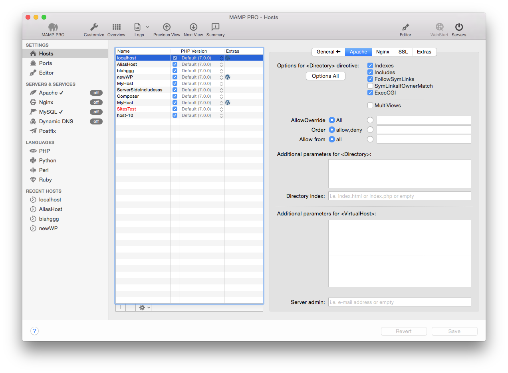

## Einstellungen > Hosts > Apache

Hier legen Sie erweiterte Optionen für den in der Tabelle markierten virtuellen Host fest. Diese Optionen sind sicherheitsrelevant!

*  **Optionen für Directive &lt;Directory&gt;**

    *  **Indexes** 
    
         Aktiviert oder deaktiviert das sogenannte directory browsing. Darunter versteht man ein Feature, das die Ansicht             einer Ordnerstruktur im Webbrowser ermöglicht. Dieses Feature kann hilfreich sein, wenn im Stammverzeichnis keine            Startdatei (z. B. index.html, index.php, etc.) vorhanden ist. In diesem Fall sorgt die Option directory browsing d           dafür, dass - beim Aufruf des Verzeichnisses im Browser - die Ordnerstruktur des Stammverzeichnisses erscheint. Ohne          directory browsing würde ansonsten eine Fehlermeldung an den Browser ausgegeben (z. B. 404 - Page not found).

    *  **Includes** 
    
         Erlaubt die Verwendung von Server Side Includes (SSI).

    *  **FollowSymLinks** 
    
         Erlaubt die Verwendung von symbolischen Links als Verweise auf Dokumente die in anderen Verzeichnissen liegen. Dies          ist hilfreich falls man auf Objekte verweisen will, die sich außerhalb des URL-Baums befinden (z. B.                         Protokolldateien des Webservers).

    *  **SymLinksIfOwnerMatch** 
    
         Dies ist eine eingeschränkte Version von FollowSymLinks, erlaubt sind nur Verweise auf Objekte derselben                     Benutzerkennung.

    *  **ExecCGI**
    
         Hiermit erlauben Sie die Ausführung von CGI-Skripten auf Ihrem virtuellen Host.

    *  **MultiViews** 
    
         Erlaubt den Einsatz von dynamischen, sprachabhängigen Dokumenten (Sprachvereinbarung).

---

*  **Weitere Parameter für &lt;Directory&gt;**

     Anweisungen aus diesem Eingabefeld trägt MAMP PRO in httpd.conf in der Directory-Direktive ein.

    *  **Directory Index**

         Bestimmen Sie welche Datei Apache anzeigt, wenn kein Dateiname in einer Adresse angegeben wird. Standardmäßig ist          dies entweder index.html oder index.php.
     
---

*  **Weitere Parameter für &lt;VirtualHost&gt;**
     
      Anweisungen aus diesem Eingabefeld trägt MAMP PRO in httpd.conf in der VirtualHost-Direktive ein.

      

      Hinweis: Achten Sie besonders auf korrekte Schreibweise, ein Tippfehler verhindert unter Umständen bereits den Start         von Apache oder öffnet eine Sicherheitslücke.
      

    
*  **Server admin**
      Geben Sie hier die E-Mail-Adresse an, an die Apache Fehlermeldungen senden soll.

