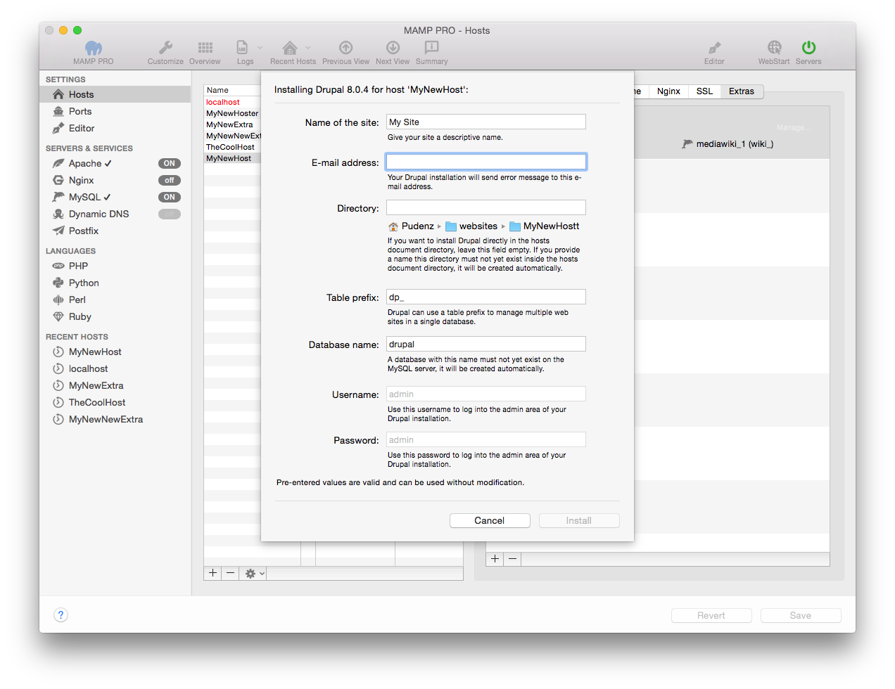

## Drupal

Drupal is content management software. It’s used to make many of the websites and applications you use every day. More information about Drupal can be found here.

*  **Name des Blogs:**  
   Geben Sie Ihrem Blog einen aussagekräftigen Namen.

*  **E-Mail-Adresse:**  
   An diese E-Mail-Adresse wird Ihre Drupal-Installation Fehlermeldungen verschicken.

*  **Verzeichnis:**  
   Wenn Sie Drupal direkt im Stammverzeichnis des Hosts installieren möchten, dann lassen Sie dieses Feld leer.

   Möchten Sie Drupal lieber in einen eigenen Ordner installieren, dann geben Sie diesen Ordnernamen an. Dieser Ordner darf noch nicht im Stammverzeichnis des Hosts existieren, denn er wird automatisch angelegt.
   

   Hinweis: Installieren Sie Wordpress nicht über eine bereits vorhandene Installation. Diese wird ansonsten überschrieben! 

   
*  **Table Prefix:**  
   The table prefix for your site.
   
*  **Datenbank-Name:**  
   Eine Datenbank mit diesem Name darf auf dem MySQL-Server noch nicht existieren. Sie wird automatisch angelegt. 
 
*  **Benutzername:**  
   Es wird automatisch der Benutzername admin verwendet.
   
   

   Hinweis: Nutzen Sie diesen Nutzernamen, um sich später auf Ihrem Drupal-Site einzuloggen.
   

*  **Passwort:**  
   Es wird automatisch das Passwort admin verwendet.
   
   

   Hinweis: Nutzen Sie dieses Passwort, um sich später auf Ihr Drupal-Site einzuloggen. Sie können es im Admin-Bereich von Drupal ändern.
   

