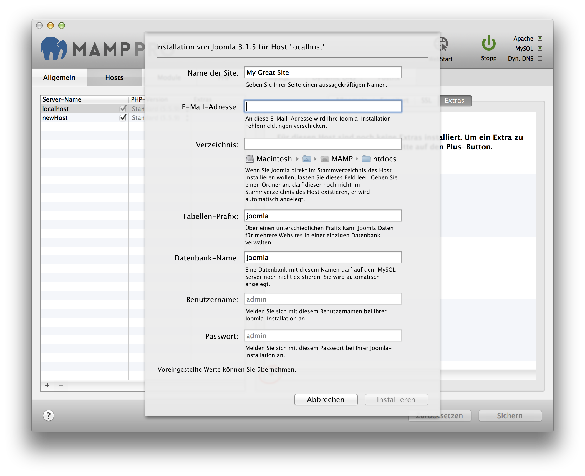

## Joomla

Joomla is a free and open-source content management system. More information about Joomla can be found [here](https://www.joomla.org){:target="_blank"}.

Installationen von Joomla können sich eine einzige MySQL-Datenbanken teilen, sofern Sie jede Joomla-Installation einen anderen Tabellen-Präfix benutzet. Um eine bereits vorhandene Datenbank zu verwenden, geben Sie den Namen der Datenbank an und wählen Sie einen neuen Tabellen-Präfix. Um eine neue Datenbank zu nutzen, wählen einen individuellen Datenbanknamen. Ein Tabellen-Präfix muss gewählt werden, das Eingabefeld darf nicht leer bleiben.

*  **Name of the site:**  
   Name your site.

*  **Email address:**  
   Your email address.  
   
   
 
   Note: You must enter a valid email address to setup a Joomla installation.
   

*  **Directory:**  
   The installation directory. If it is left blank the Joomla files will be copied directly to the document root folder.  
  
   
 
   Note: Do not install over a previous installation of Joomla! Files will be overwritten without warning. 
   

*  **Tabellen-Präfix:**  
   Durch die Verwendung von unterschiedlichen Tabellen-Präfixen kann Joomla Daten für mehrere Websites in einer einzigen        Datenbank verwalten.

*  **Datenbank-Name:**  
   Auf dem MySQL-Server darf noch keine Datenbank mit dem selben Datenbanknamen vorhanden sein. Die Datenbank wird              automatisch erzeugt. 

*  **Username:**  
   The Joomla admin.
   

   Note: You will need this username to login into your new of Joomla site, please write this down. 
   

*  **Password:**  
   The Joomla admin's default password.  
   
   
   Note: You will need this password to login into your new Joomla site, please write this down.
   

