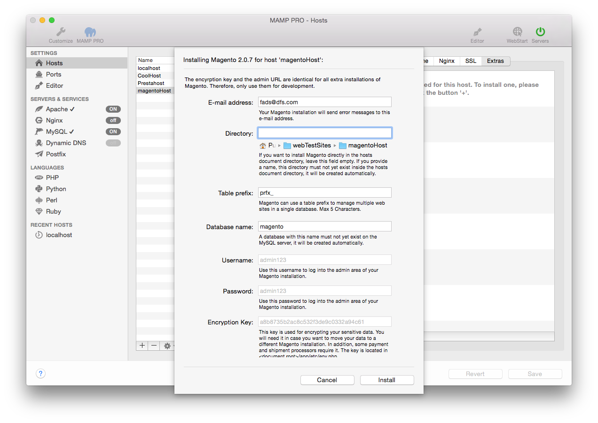

## Magento

Magento Commerce is a popular php based e-commerce platform. More information about Magento can be found [here](https://www.magento.com){:target="_blank"}.

*  **E-Mail-Adresse:**  
   An diese E-Mail-Adresse wird Ihre Magento-Installation Fehlermeldungen verschicken.  
   
   
   Hinweis: Um Magento zu installieren, ist die Eingabe einer gültigen E-Mail-Adresse erforderlich.
   

*  **Verzeichnis:**  
   Wenn Sie Magento direkt im Stammverzeichnis des Hosts installieren möchten, dann lassen Sie dieses Feld leer.

   Möchten Sie Magento lieber in einen eigenen Ordner installieren, dann geben Sie diesen Ordnernamen an. Dieser Ordner    darf noch nicht im Stammverzeichnis des Hosts existieren, denn er wird automatisch angelegt.
   
   

   Hinweis: Installieren Sie Magento nicht über eine bereits vorhandene Installation. Diese wird ansonsten überschrieben!
   

*  **Tabellen-Präfix:**  
   Durch Verwendung unterschiedlicher Tabellen-Präfixe kann Magento Daten für mehrere Websites in einer einzigen Datenbank verwalten.

*  **Datenbank-Name:**  
   Eine Datenbank mit diesem Name darf auf dem MySQL-Server noch nicht existieren. Sie wird automatisch angelegt.
 
*  **Benutzername:**  
   Es wird automatisch der Benutzername admin verwendet.  
   
   

   Hinweis: Nutzen Sie diesen Nutzernamen, um sich später auf Ihrem Magento-Blog einzuloggen.*  
   

*  **Passwort:**  
   Es wird automatisch das Passwort admin verwendet.  
   
   

   Hinweis: Nutzen Sie dieses Passwort, um sich später auf Ihr Magento-Blog einzuloggen. Sie können es im Admin-Bereich      von Magento ändern.
   

*  **Encryption:**  
   This key is used for encrypting your sensitive data. You will need it if you move your data to a different Magento installation. Some payment and shipment processors require it. The key is located in <document root>/app/etc/env.php .

