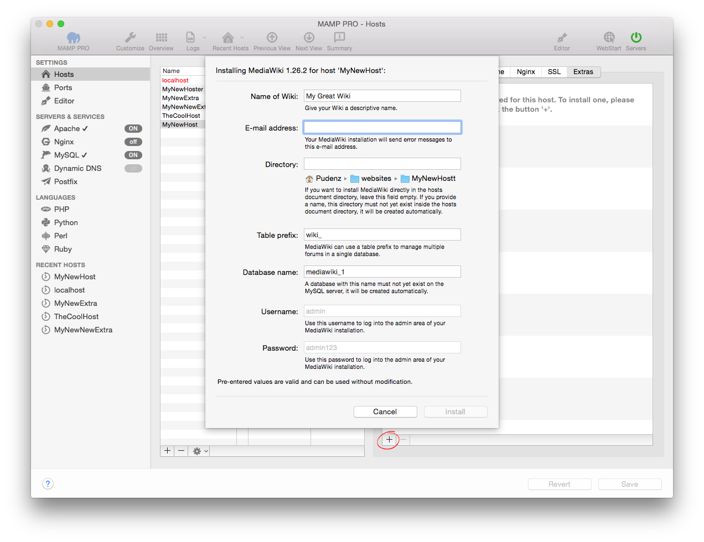

## Mediawiki

MediaWiki is a free software open source wiki package written in PHP, originally for use on Wikipedia. It is now also used by several other projects of the non-profit Wikimedia Foundation and by many other wikis. You can find more information about MediaWiki [here](https://www.mediawiki.org){:target="_blank"}.

*  **Name des Wiki:**  
   Geben Sie Ihrem Wiki einen aussagekräftigen Namen.

*  **E-Mail-Adresse:**  
   An diese E-Mail-Adresse wird Ihre MediaWiki-Installation Fehlermeldungen verschicken.  
   
   
   
   Hinweis: Um MediaWiki zu installieren, ist die Eingabe einer gültigen E-Mail-Adresse erforderlich.
   

*  **Verzeichnis:**  
   Wenn Sie MediaWiki direkt im Stammverzeichnis des Hosts installieren möchten, dann lassen Sie dieses Feld leer.

   Möchten Sie MediaWiki lieber in einen eigenen Ordner installieren, dann geben Sie diesen Ordnernamen an. Dieser Ordner  darf noch nicht im Stammverzeichnis des Hosts existieren, denn er wird automatisch angelegt.
   
   
   
   Hinweis: Installieren Sie MediaWiki nicht über eine bereits vorhandene Installation. Diese wird ansonsten überschrieben!* 
   

   
*  **Tabellen-Präfix:**  
   Durch Verwendung unterschiedlicher Tabellen-Präfixe kann Mediawiki Daten für mehrere Websites in einer einzigen Datenbank verwalten.

*  **Datenbank-Name:**  
   Eine Datenbank mit diesem Name darf auf dem MySQL-Server noch nicht existieren. Sie wird automatisch angelegt.
 
*  **Benutzername:**  
   Es wird automatisch der Benutzername admin verwendet.  
   
   
   Hinweis: Nutzen Sie diesen Nutzernamen, um sich später auf Ihrem Wiki einzuloggen.*  
   
   

*  **Passwort:**  
   Es wird automatisch das Passwort admin verwendet.  
   
   
   Hinweis: Nutzen Sie dieses Passwort, um sich später auf Ihr Wiki einzuloggen. Sie können es im Admin-Bereich von MediaWiki ändern.
   

