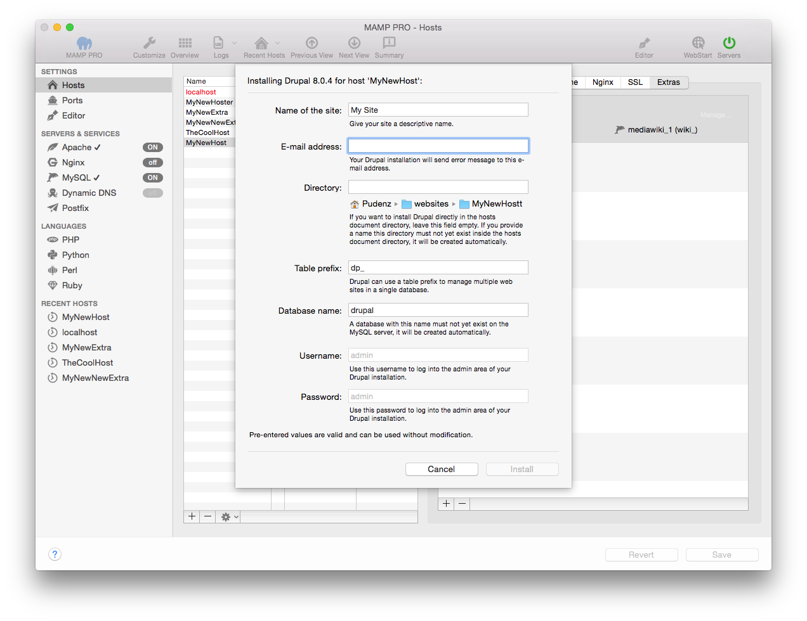

## Prestashop

*  **Name des Blogs:**  
   Geben Sie Ihrem Blog einen aussagekräftigen Namen.

*  **E-Mail-Adresse:**  
   An diese E-Mail-Adresse wird Ihre PrestaShop-Installation Fehlermeldungen verschicken.  
   
Hinweis: Um PrestaShop zu installieren, ist die Eingabe einer gültigen E-Mail-Adresse erforderlich.
   

*  **Verzeichnis:**  
   Wenn Sie PrestaShop direkt im Stammverzeichnis des Hosts installieren möchten, dann lassen Sie dieses Feld leer.

   Möchten Sie PrestaShop lieber in einen eigenen Ordner installieren, dann geben Sie diesen Ordnernamen an. Dieser Ordner  darf noch nicht im Stammverzeichnis des Hosts existieren, denn er wird automatisch angelegt.
   
   

   Hinweis: Installieren Sie Wordpress nicht über eine bereits vorhandene Installation. Diese wird ansonsten überschrieben!
   

   
*  **Tabellen-Präfix:**  
   Durch Verwendung unterschiedlicher Tabellen-Präfixe kann PrestaShop Daten für mehrere Websites in einer einzigen Datenbank verwalten.

*  **Datenbank-Name:**  
   Eine Datenbank mit diesem Name darf auf dem MySQL-Server noch nicht existieren. Sie wird automatisch angelegt.
 
*  **Benutzername:**  
   Es wird automatisch der Benutzername admin verwendet.  
   

   Hinweis: Nutzen Sie diesen Nutzernamen, um sich später auf Ihrem Prestashop-Blog einzuloggen.
   

   
*  **Passwort:**  
   Es wird automatisch das Passwort admin verwendet.  
   

   Hinweis: Nutzen Sie dieses Passwort, um sich später auf Ihr PrestaShop-Blog einzuloggen. Sie können es im Admin-Bereich von PrestaShop ändern.
   

