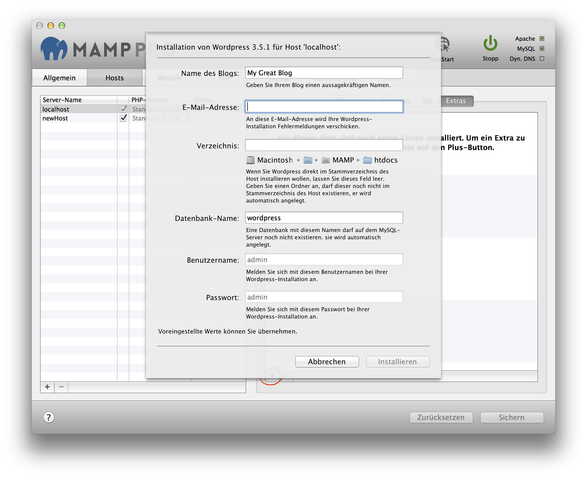

## Wordpress

WordPress is a free and open-source content management system based on PHP and MySQL. More information about Wordpress can be found [here](https://de.wordpress.org){:target="_blank"}.

Note: When some Content Management Systems such as Wordpress are setup the host name and Apache port number are stored in their database. Going forward the Apache port in MAMP PRO cannot be changed. A change in the Apache port will result in breaking the CMS, returning only a vague error message. Content Management Systems usually provide a mechanism for changing the host and port names. If changes are made in the CMS, then they must also be made in MAMP PRO.

*  **Name des Blogs:**  
   Geben Sie Ihrem Blog einen aussagekräftigen Namen.

*  **E-Mail-Adresse:**  
   An diese E-Mail-Adresse wird Ihre Wordpress-Installation Fehlermeldungen verschicken.  
   
   
   Hinweis: Um Wordpress zu installieren, ist die Eingabe einer gültigen E-Mail-Adresse erforderlich.
   

*  **Verzeichnis:**  
   Wenn Sie Wordpress direkt im Stammverzeichnis des Hosts installieren möchten, dann lassen Sie dieses Feld leer.

   Möchten Sie Wordpress lieber in einen eigenen Ordner installieren, dann geben Sie diesen Ordnernamen an. Dieser Ordner  darf noch nicht im Stammverzeichnis des Hosts existieren, denn er wird automatisch angelegt.
   
   

   Hinweis: Installieren Sie Wordpress nicht über eine bereits vorhandene Installation. Diese wird ansonsten überschrieben!
   

  
*  **Table prefix:**  
   Set the name of your database schema prefix. Wordpress offers the ability to manage multiple websites using a single database schema.

*  **Datenbank-Name:**  
   Eine Datenbank mit diesem Name darf auf dem MySQL-Server noch nicht existieren. Sie wird automatisch angelegt.
 
*  **Benutzername:**  
   Es wird automatisch der Benutzername admin verwendet.  
   
   

   Hinweis: Nutzen Sie diesen Nutzernamen, um sich später auf Ihrem Wordpress-Blog einzuloggen.*  
   

*  **Passwort:**  
   Es wird automatisch das Passwort admin verwendet.  
   
   

   Hinweis: Nutzen Sie dieses Passwort, um sich später auf Ihr Wordpress-Blog einzuloggen. Sie können es im Admin-Bereich  von Wordpress ändern.
   

