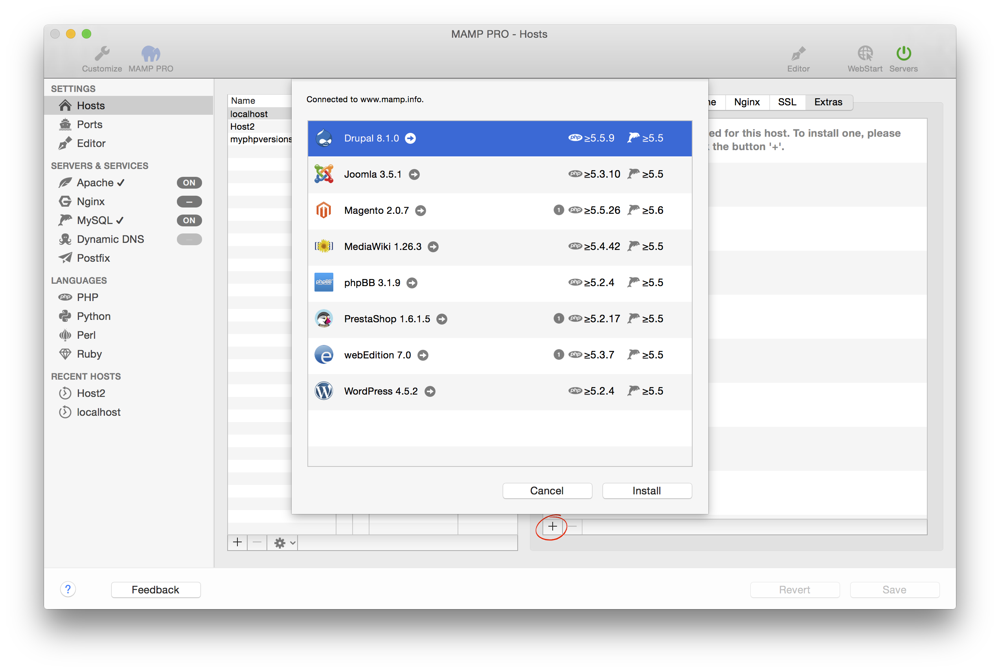

## Einstellungen > Hosts > Extras
MAMP PRO ermöglicht Ihnen das einfache Hinzufügen von sogenannten Extras zu Ihren virtuellen Hosts. Bei bestehender Internetverbindung werden alle Extras von unseren Servern geladen. Die Anzahl der Extras wird ständig erweitert.

Um ein Extra zu installieren, wählen Sie zunächst den virtuellen Host aus auf dem das Extra installiert werden soll. Klicken Sie anschließend "+"-Button (ohne installierte Extras ist der rot umrandet) und wählen Sie das Extra, das Sie installieren möchten. Füllen Sie nun die notwendigen Felder aus und klicken Sie abschließend auf Installieren.

- [WordPress](WordPress/)  
- [Joomla](Joomla/)  
- [Drupal](Drupal/) 
- [webEdition](webEdition/)
- [Magento](Magento/)
- [Mediawiki](Mediawiki/) 
- [phpBB](phpBB/) 
- [PrestaShop](PrestaShop/) 

---

Hinweis: Die Verfügbarkeit eines Extras kann abhängig sein von:
der PHP-Version des Host
dem Vorhandensein einer Internetverbindung
den bereits zwischengespeicherten Extras
Ihrem verfügbaren Festplattenplatz

