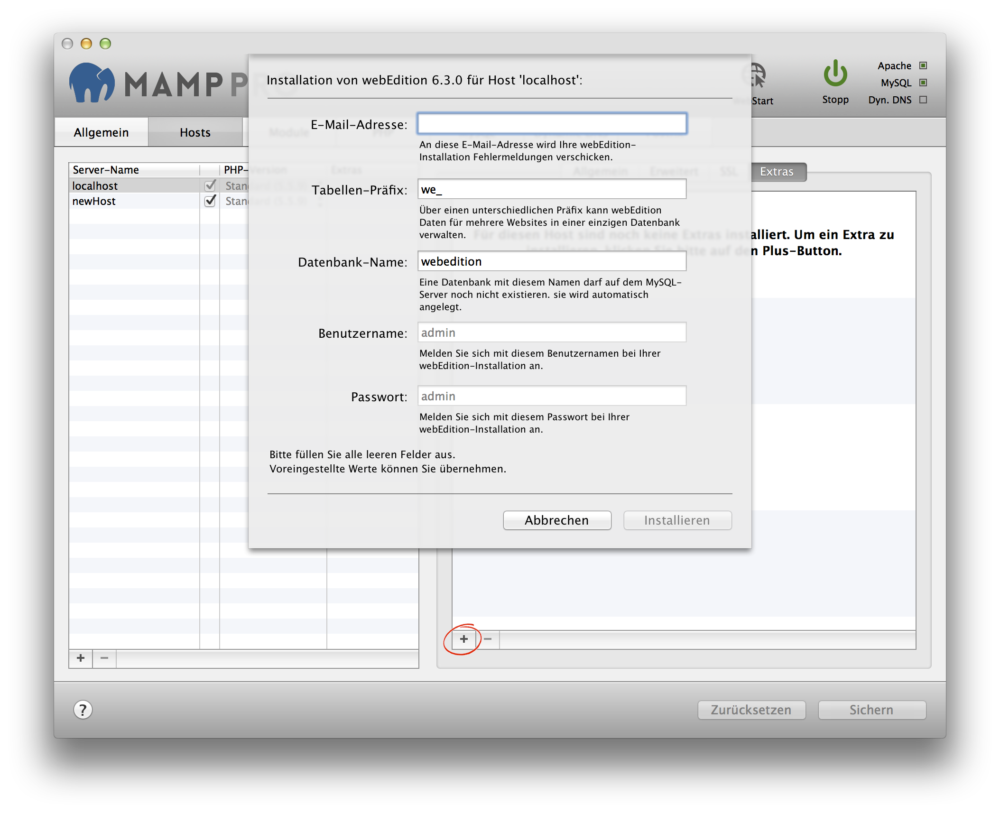

## webEdition

webEdition is an open source web application framework and content management system. webEdition will always be installed in a folder called webEdition inside the document root folder. More information about webEdition can be found [here](https://www.webedition.org){:target="_blank"}.

Das CMS webEdition wird immer im Ordner /webEdition innerhalb des Stammverzeichnisses installiert.

*  **Email address:**  
   Your email address.
   
   
   Note: You must enter a valid email address to setup a webEdition installation.
   

*  **Tabellen-Präfix:**  
   Durch Verwendung unterschiedlicher Tabellen-Präfixe kann webEdition Daten für mehrere Websites in einer einzigen Datenbank verwalten.

*  **Databank-Name:**  
   Auf dem MySQL-Server darf noch keine Datenbank mit dem selben Datenbanknamen vorhanden sein. Die Datenbank wird         automatisch erzeugt.

*  **Username:**  
   The webEdition admin.
   
   
   Note: You will need this username to login into your new webEdition site, please write this down.  
   

*  **Password:**  
   The webEdition admin's default password.
   
   
   Note: You will need this password to login into your new webEdition site, please write this down.
   

*  **Directory:**  
   webEdition will be installed in a subdirectory of your document root named webEdition.

