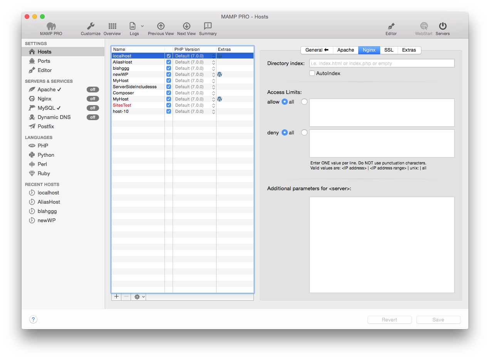

## Einstellungen > Hosts > Nginx

Hier legen Sie erweiterte Optionen für den in der Tabelle markierten virtuellen Host fest. Diese Optionen sind sicherheitsrelevant!

*  **Directory index**  

*  **Access Limits**  

    *  **allow**  
    *  **deny**  
    
*  **Additional parameters for &lt;server&gt;**  

Add additional parameters to the <server> directive here.
