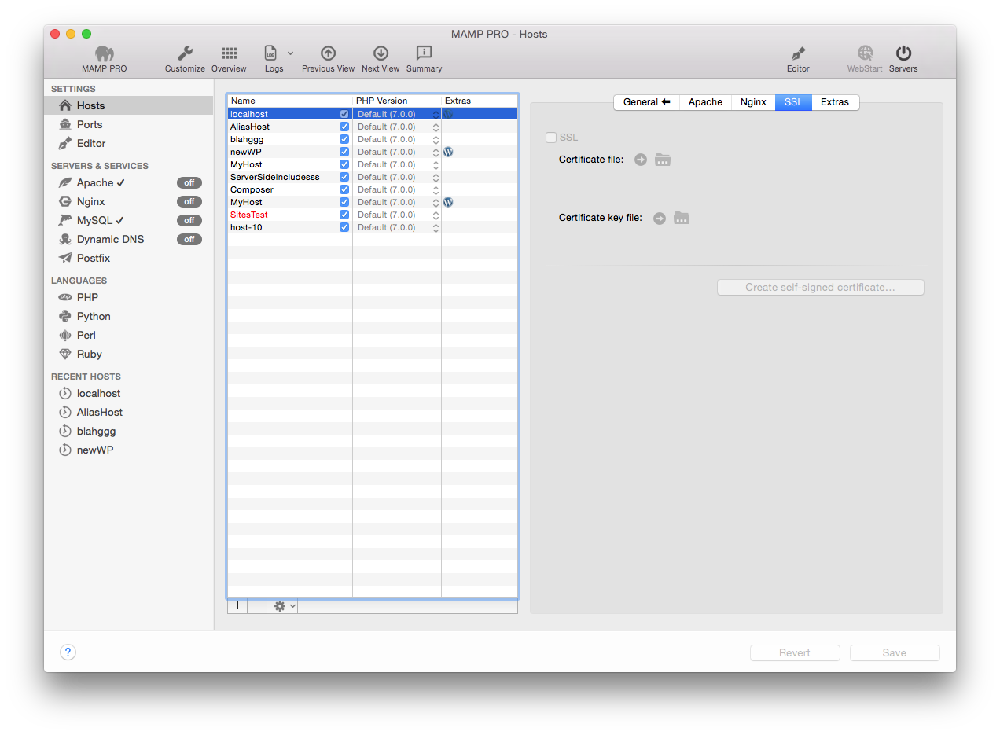

## Einstellungen > Hosts > SSL

Um den Datenverkehr zwischen Apache und Webbrowser zu verschlüsseln, können Sie SSL verwenden.

Geben Sie jeweils den Speicherort Ihrer Zertifikats-Datei und Ihres privaten Schlüssels an.

Um die SSL-Funktionalität zu testen, können Sie sich ein selbst signiertes Zertifikat erstellen. Klicken Sie dafür auf Selbst signiertes Zertifikat erstellen und füllen Sie die entsprechenden Felder aus. Klicken Sie danach auf “Generieren…” und wählen Sie anschliessend den Speicherort Ihres selbst signierten Zertifikats und Schlüssels aus. Die Speicherorte werden von MAMP PRO automatisch übernommen und sie können die SSL-Funktionalität testen.

Um SSL auf einem Produktionsserver zu verwenden, sollten Sie ein Zertifikat einer zertifizierten Behörde einsetzen.

