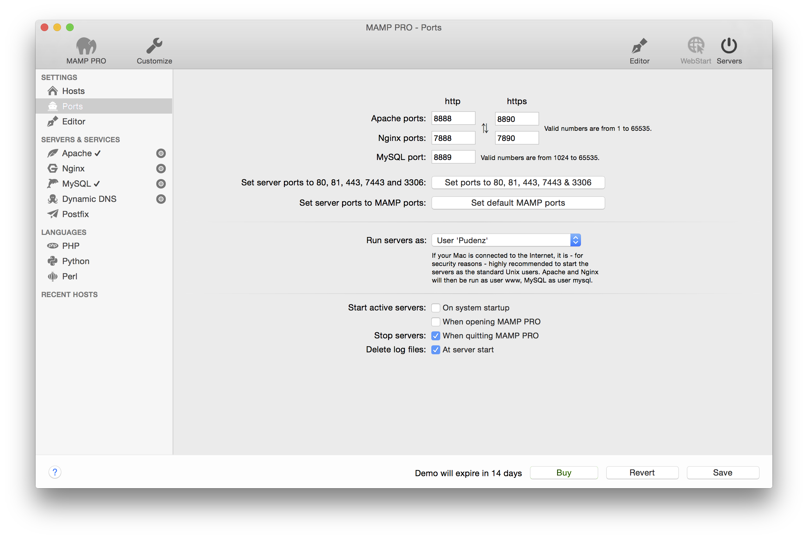

## Ports

Serverdienste die über das Netzwerk angesprochen werden, müssen einem bestimmten Netzwerk-Port zugeordnet werden. Nur dadurch können mehrere unterschiedliche Serverdienste parallel auf einem Rechner betrieben werden. Für jeden Dienst gibt es Standard-Ports, auf denen diese üblicherweise bereitgestellt werden. Beispielsweise wird ein Webserverdienst normalerweise auf dem Port 80 betrieben, der MySQL-Datenbankserverdienst nutzt den Port 3306.

Diese Ports sind konfigurierbar. Die Standardkonfiguration von MAMP PRO verwendet die Ports 8888, 8890 (Apache) und 8889 (MySQL). Diese Ports werden anderweitig selten verwendet. Auf diese Weise können die MAMP-Server parallel zu anderen Servern auf Ihrem Mac betrieben werden, da keine Port-Konflikte zu erwarten sind. Sollten die Ports dennoch bereits in Verwendung einer andere Anwendung sein, ändern Sie bitte die Werte entsprechend.
Die Schaltfläche Ports auf 80, 443 & 3306 setzen stellt die Portnummern auf die allgemein im Internet verwendeten Werte ein. Die Schaltfläche MAMP-Ports setzen stellt die Ports von Apache und MySQL wieder auf die Standardwerte zurück.

*  **Apache und MySQL als Benutzer starten:** 
      Jedes Programm wird unter einem bestimmten Benutzer des Betriebssystems ausgeführt. Üblich ist der Benutzer www für den       Webserver und der Benutzer mysql für den MySQL-Datenbankserver. Werden Dateien häufig mit externen Editoren bearbeitet,       vermeidet man Schwierigkeiten mit den Zugriffsrechten, wenn die Server unter dem eigenen Benutzernamen laufen. Wählen        sie in der Auswahlbox unter welchem Benutzer die Server gestartet werden sollen.

      

      Hinweis: Sie sollten die Server nur unter Ihrem eigenen Benutzernamen starten, wenn der Rechner ausreichend gegen potenziell bösartige Zugriffe aus dem Internet geschützt ist. Ansonsten könnten kompromittierte Skripte auf dem   Webserver den uneingeschränkten Zugriff auf Ihre persönlichen Daten ermöglichen.
      Apache und MySQL beim Systemstart automatisch starten
      Die Apache- und MySQL-Server werden beim Start des Betriebssystems automatisch gestartet, d.h. die Dienste stehen schon vor der Benutzeranmeldung zur Verfügung.
      

*  **Beim Öffnen von MAMP PRO Apache und MySQL starten**
      Die Serverdienste werden beim Öffnen von MAMP PRO automatisch gestartet.

*  **Beim Beenden von MAMP PRO Apache und MySQL stoppen**
      Die Serverdienste werden beim Beenden von MAMP PRO automatisch gestoppt.

*  **Logdateien bei Server-Start löschen**
      Die Logdateien werden vor dem Starten der Serverdienste geleert. Dadurch sind immer nur Einträge seit dem letzten            Serverstart in den Logdateien enthalten.

*  **Fehlerdatei von Apache**
      Sollte es beim Starten oder während des Betriebs des Apache-Servers zu Fehlern kommen, werden diese in einer Logdatei        festgehalten. Legen Sie hier fest, wo diese Datei gespeichert werden soll.
