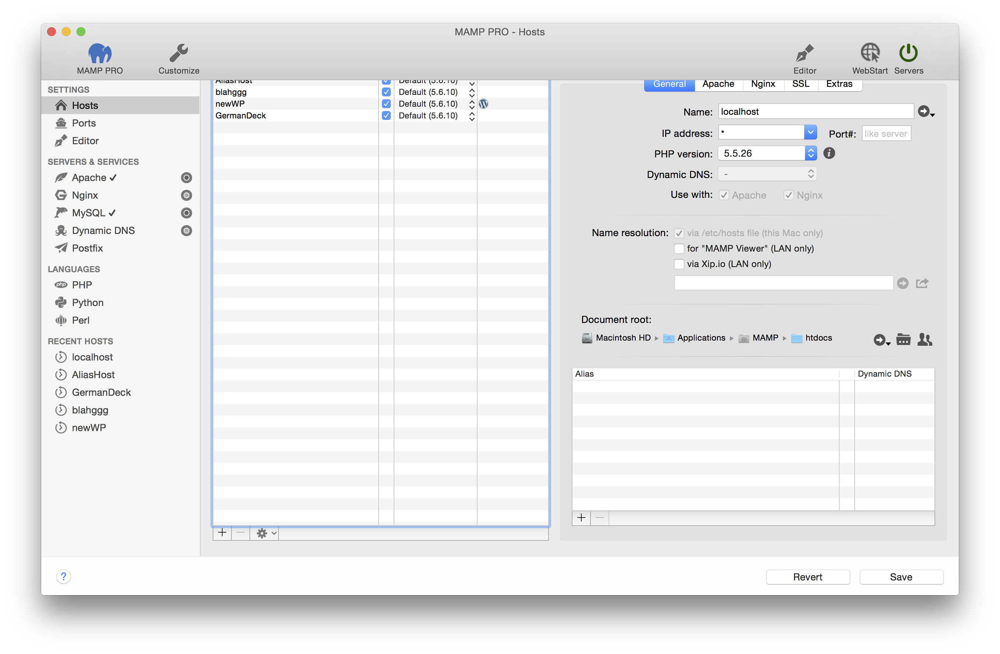

## Erste Schritte

Beim ersten Start von MAMP PRO werden einige Helfer-Tools installiert. Sie werden aufgefordert Ihr Kennwort einzugeben.

Klicken Sie auf die Schaltfläche Start in der Titelleiste von MAMP PRO. In der Statusanzeige oben rechts wird der Status der Server angezeigt.

Der Apache-Server wird standardmäßig auf Port 8888 betrieben. Dieser Port muss beim Aufruf der lokalen Webseite im Browser zusätzlich mit angegeben werden: http://localhost:8888 . A check mark next to the server/service indicates that this server/service will start/stop when the Servers button is pressed. 

Der Standard-Host für MAMP PRO lautet localhost. Die Dateien für localhost werden nach der Installation im Ordner Programme/MAMP/htdocs abgelegt. Mehr Informationen zu Hosts finden Sie im Abschnitt 2. Hosts.

---

### Das Hauptfenster

*  **Ausstattung**  
   Sonder Ausstattung. Additional information about the toolbar can be found in the [Customize](../Customize/) section.

*  **MAMP PRO**  
   [https://mamp.info](https://www.mamp.info/de){:target="_blank"} Webseite öffnen.

*  **Webstart**  
   Öffnet die MAMP PRO Startseite Ihres lokalen Webservers. Zusätzliche Informationen zu WebStart finden Sie im Abschnitt 2. Hosts.

*  **Editor**  
   [Editor](../Editor/) öffnen.

*  **Servers**  
   Die Statusanzeige rechts oben zeigt an, welche Dienste derzeit gestartet sind ([Apache](../Servers-und-Services/Apache), [Nginx](../Servers-und-Services/Nginx), [MySQL](../Servers-und-Services/MySQL), Dynamic DNS).

*  **Revert**  
   Discards all changes, which have not already been confirmed with `Save`.
   
*  **Save**  
   Save your changed settings.

---

### Icons

 Wählt ein Verzeichnis aus oder bestimmt einen Speicherort.

 Bereitet eine neue E-Mail mit Xip.io-Informationen zum Versand vor.

 Ändert die Zugriffsrechte des Document-Root-Verzeichnisses.

  Zeigt ein Verzeichnis im Finder an oder verbindet mit dem Webbrowser zu einem Host.

  Zeigt weitere Informationen, etwa die Ausgabe von phpInfo().

  Weist auf eine fehlende Information hin.

 Add a new PHP version.
