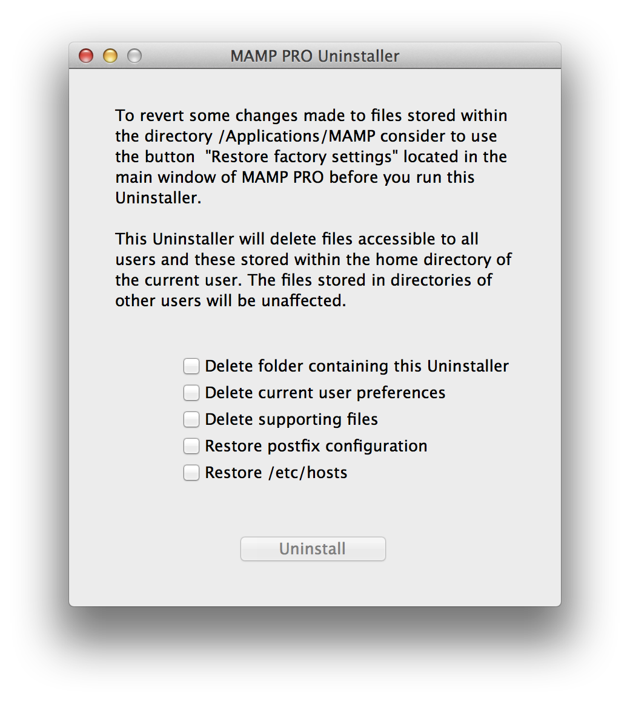

### De-Installation

Um MAMP PRO einschließlich aller Konfigurationsdateien von Ihrem System zu entfernen, verwenden Sie bitte den MAMP PRO Uninstaller in `/Programme/MAMP PRO`.

Löschen Sie den Ordner `/Programme/MAMP`, um den Vorgang abzuschliessen.

