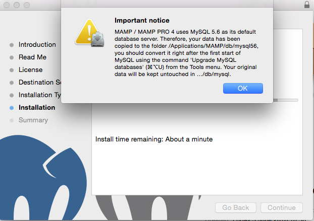
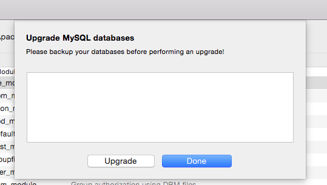
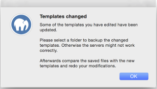
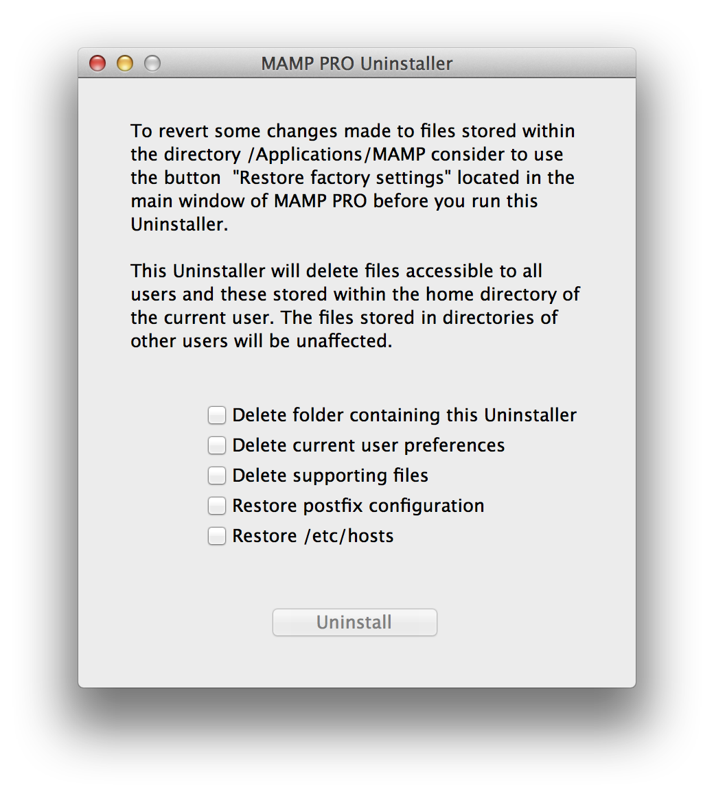

## Installation

### Installationsvoraussetzungen

MAMP PRO setzt Folgendes voraus:

- Eine bestehende MAMP-Installation (MAMP wird direkt mit dem Installationspaket von MAMP PRO heruntergeladen).
- Betriebssystem: OS X ab Version 10.8.0 oder höher.
- Ein Mac mit 64-Bit-CPU (x64) von Intel.
- Um mit MAMP PRO arbeiten zu können, müssen Sie mit einem Benutzerkonto angemeldet sein, das den Rechner verwalten darf. Überprüfen Sie dies unter Systemeinstellungen -> Benutzer und Gruppen.

---

### Installation und Update von MAMP PRO

#### Neue Installation

1. Laden Sie MAMP PRO von unserer Webseite https://www.mamp.info herunter.
2. Öffnen Sie die geladene Datei MAMP_MAMP_PRO_4.0.pkg per Doppelklick
3. Das Installationsprogramm wird Sie durch den Installationsprozess führen.
4. Falls Sich bereits eine Version von MAMP auf ihrem Rechner befindet:
    Ein bereits vorhandener MAMP-Ordner wird in MAMP_aktuelles_Datum umbenannt.
    Ein bereits vorhandener htdocs-Ordner wird in den neuen Ordner `/Programme/MAMP` verschoben.
5. Überprüfen Sie, ob alle Dateien korrekt verschoben wurden, bevor Sie MAMP PRO starten.
6. Der Ordner `/Programme/MAMP_aktuelles_Datum` kann gelöscht werden. Sie können ihn aber auch behalten, falls Sie zu einem späteren Zeitpunkt noch einmal darauf zugreifen möchten.

Hinweis: Um MAMP PRO zu installieren, benötigen Sie Administratorrechte!

#### Update von MAMP PRO 3 auf MAMP PRO 4

1. Laden Sie MAMP PRO von unserer Webseite https://www.mamp.info herunter.
2. Öffnen Sie die geladene Datei MAMP_MAMP_PRO_4.0.pkg per Doppelklick
3. Falls Sich bereits eine Version von MAMP auf ihrem Rechner befindet:
    Ein bereits vorhandener MAMP-Ordner wird in MAMP_aktuelles_Datum umbenannt.
    Ein bereits vorhandener htdocs-Ordner wird in den neuen Ordner `/Programme/MAMP` verschoben.
4. Überprüfen Sie, ob alle Dateien korrekt verschoben wurden, bevor Sie MAMP PRO starten.
5. Der Ordner `/Programme/MAMP_aktuelles_Datum` kann gelöscht werden. Sie können ihn aber auch behalten, falls Sie zu einem     späteren Zeitpunkt noch einmal darauf zugreifen möchten.
6. If you were using MySQL 5.5 (most likely scenerio) you will be informed to upgrade your MySQL to 5.6 . This is         recommended. Your original database data has been copied from `/Library/Application Support/appsolute/MAMP PRO/db/mysql` to `/Library/Application Support/appsolute/MAMP PRO/db/msql56`. 

 
7. When the installation process is finished and you open MAMP PRO for the first time you prompted to upgrade your databases to MySQL 5.6. Click Upgrade to upgrade your databases. 

8. The installation process will create an `/Applications/MAMP_current_date` folder. This folder can now be deleted. You may however keep it, so you can fall back to your original setup.

#### Update von MAMP PRO 4.xx auf MAMP PRO 4.xx

1. Laden Sie MAMP PRO von unserer Webseite https://www.mamp.info herunter.
2. Öffnen Sie die geladene Datei MAMP_MAMP_PRO_4.0.pkg per Doppelklick
3. Das Installationsprogramm wird Sie durch den Installationsprozess führen.
4. Falls Sich bereits eine Version von MAMP auf ihrem Rechner befindet:
    Ein bereits vorhandener MAMP-Ordner wird in MAMP_aktuelles_Datum umbenannt.
    Ein bereits vorhandener htdocs-Ordner wird in den neuen Ordner `/Programme/MAMP` verschoben.
5. If there has been a change to the configuration of Apache, PHP, or MySQL (A directive was modified or a new one added)    between versions of MAMP PRO and you have already made changes to your current configuration (resulting in the creation of a template file in ~/Library/application support/appsolute/MAMP PRO/templates ), MAMP PRO will ask you to save off your old templates when you upgrade.

    
  
    Save your template files. You can use these saved template files as a guide of your previous modifications. New         (re) modifications need to be made through the MAMP PRO interface (File > Edit Templates), just as you had done before in your previous version of MAMP PRO.

6. Confirm that all data has been transferred correctly before starting MAMP PRO.
7. Your `/Applications/MAMP_current_date` folder can now be deleted. You may however keep it, so you can fall back to your original setup.

 
---

### De-Installation

Um MAMP PRO einschließlich aller Konfigurationsdateien von Ihrem System zu entfernen, verwenden Sie bitte den MAMP PRO Uninstaller in `/Programme/MAMP PRO`.

Löschen Sie den Ordner `/Programme/MAMP`, um den Vorgang abzuschliessen.

