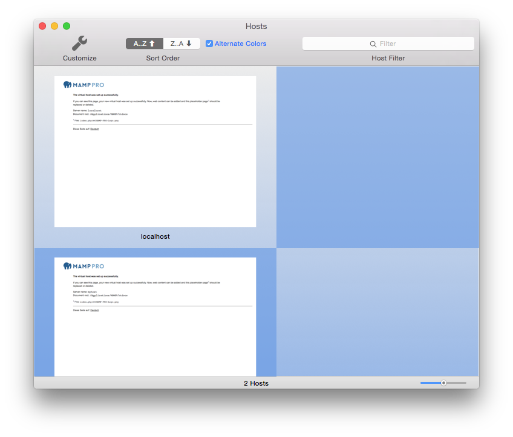
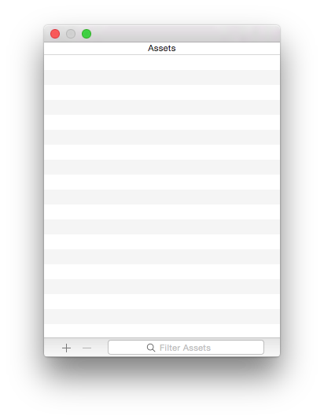
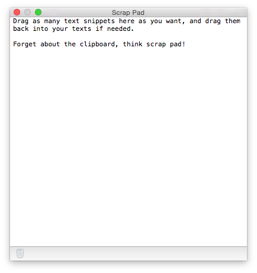

## Fenster

*  **Overview** 
    Look at a quick preview of your websites ...

You can use the overview ... press the Arrow button to look 

---

*  **Assets** 
    Track your assets using the Asset Manager
  

The Asset Manager .... 

---

*  **Scrap Pad** 
    Use your scrap pad to ... scrap  

With the scrap pad ... you a scrappy

---

### Summary

A summary of your setup
