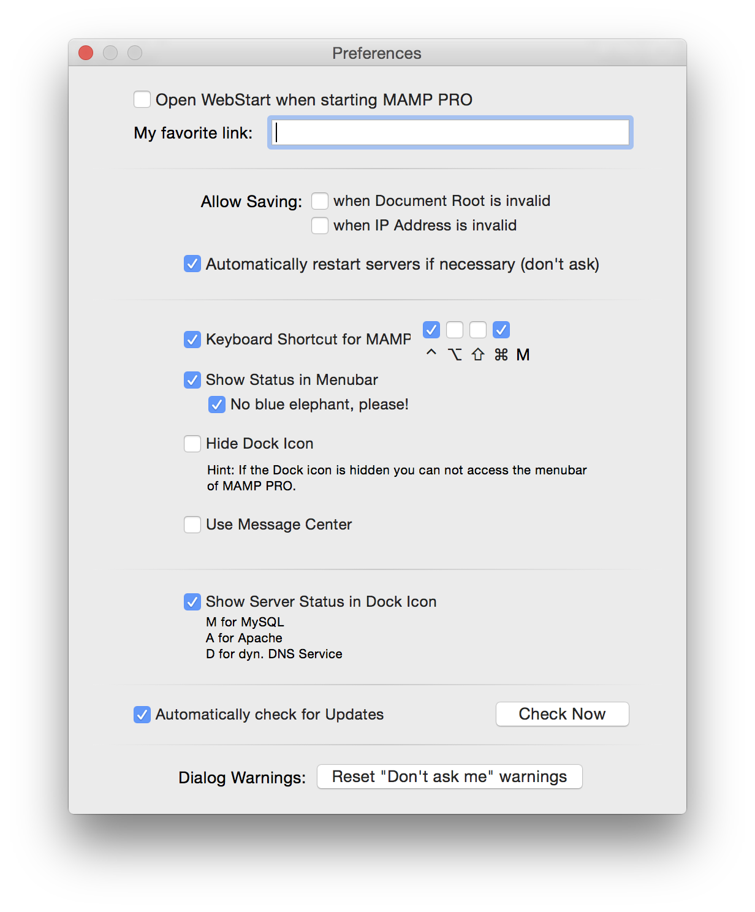

## Menü

### MAMP PRO

#### Nach Updates suchen

Hier können Sie überprüfen, ob ein Update für MAMP PRO zur Verfügung steht. Es wird jedoch nicht nach neuen Versionen einzelner Komponenten gesucht.

 

#### Öffne WebStart bei Start von MAMP PRO

Ihr Standard-Browser öffnet sich und die WebStart-Seite von MAMP PRO wird geöffnet.

 

#### WebStart-Pfad

Hier geben Sie an, welche Seite von Ihrem Browser geöffnet wird, wenn Sie auf den Button webStart klicken (bzw. welche Seite sich automatisch beim Starten von MAMP PRO öffnet  sofern Sie diese Funktion aktiviert haben).

 

#### Voreingestellt (/MAMP/) öffnet MAMP PRO die MAMP-PRO-WebStart-Seite.

Neben Links zu Dienstprogrammen wie PhpMyAdmin, phpInfo, SQLite Manager, PhpLiteAdmin, FAQ und der MAMP-Website, bekommen Sie die aktuelle Versionsnummer Ihrer Installation angezeigt. Darüber hinaus gibt es allgemeine News zu MAMP PRO.

 

#### Lassen Sie das WebStart-Pfad-Feld leer, dann werden Sie im Webbrowser zu http://localhost:8888 geleitet. 

 

#### Wenn Sie ein /Unterverzeichnis in dieses Feld eingeben, werden Sie auf das Programme/MAMP/ htdocs/Unterverzeichnis geleitet - mit Ihrem Webbrowser via http://localhost:8888/Unterverzeichnis.

 

“Sichern” erlauben

bei ungültigen Speicherort

MAMP PRO wird ungültige Host-Pfade ignorieren und vorgenommene Einstellungen trotzdem speichern.

 

bei ungültiger IP-Adresse

MAMP PRO wird ungültige Host-IP-Adressen ignorieren und vorgenommene Einstellungen trotzdem speichern. 

 

Hinweis: Die Verwendung dieser Einstellungen kann den Start von Apache verhindern.
 

#### Server automatisch ohne Nachfrage neu starten, falls nötig

MAMP PRO startet automatisch die Server neu, wenn Änderungen vorgenommen werden, die einen Neustart erfordern.

 

#### Tastaturkürzel für MAMP PRO

Hier legen Sie die Tastaturkombination fest, die das Hauptfenster von MAMP PRO in den Vordergrund bringt. Die Taste “M” ist fester Bestandteil des Kürzels und kann nicht verändert werden. Das Zeichen “^” symbolisiert die ctrl-Taste. 

 

#### Status in der Menüleiste anzeigen*

Ein Elefanten-Symbol wird in der Menüleiste angezeigt. Aktive MAMP-PRO-Server werden durch einen blauen Elefanten symbolisiert, inaktive durch einen schwarzen.

 

Dock-Symbol ausblenden (OS X 10.7 oder höher)

Hiermit können Sie das Dock-Icon ausblenden.

Hinweis: Bitte beachten Sie, dass Sie bei ausgeblendetem Dock-Icon nicht mehr auf die Menübar von MAMP PRO zugreifen können.
 

#### Ohne Dock-Symbol Mitteilungszentrale nutzen (OS X 10.8 oder höher)

Die Mitteilungszentrale von OS X informiert Sie über den Start von Apache und MySQL. Die Mitteilungszentrale kann nur verwendet werden, wenn das Dock-Symbol ausgeblendet ist.

 

#### Beim Start von MAMP PRO auf Updates überprüfen

Ist diese Einstellung aktiviert, überprüft MAMP PRO bei jedem Start, ob ein Update für MAMP PRO vorliegt.

### Ablage

Einstellungen, die Sie in MAMP PRO vornehmen, werden beim Speichern in Konfigurationsdateien für die Server geschrieben. Dazu verwendet MAMP PRO Vorlagen, in denen auch weitere Konfigurationsoptionen fest enthalten sind. Sie können diese Vorlagen unter dem Menüpunkt Ablage > Vorlagen editieren und verändern. Dadurch können Sie auch auf Optionen zugreifen, die in der MAMP PRO Oberfläche nicht verfügbar sind.

 

Hinweis: Fehler in den Vorlagen der Konfigurationsdateien können dazu führen, dass Server nicht mehr starten. Dies kann bedeuten, dass Sie MAMP PRO zurücksetzen müssen und alle Einstellungen verlieren. Sie sollten diese Vorlagen daher nur bearbeiten, wenn Sie mit der exakten Syntax und Bedeutung der Optionen vertraut sind!
 

#### Werkseinstellungen

 

##### Entwicklung

Hiermit werden die Einstellungen aller virtuellen Hosts und die Servereinstellungen zurückgesetzt. Die Ports werden auf 8888, 8890 und 8889 zurückgesetzt, Apache- und MySQL-Benutzer auf username/username.

 

##### Live

Hiermit werden die Einstellungen aller virtuellen Hosts und die Servereinstellungen zurückgesetzt. Der Apache-Port wird auf 80, 440 und 3306 zurückgesetzt, Apache- und MySQL-Benutzer auf www/mysql.

 

#### Backup…

Hiermit erstellen Sie ein Backup Ihrer Host-Einstellungen und Datenbankdateien. 

 

#### Aus Backup wiederherstellen…

Stellen Sie Ihre Host-Einstellungen und MySQL-Datenbankdateien aus einem Backup wieder her.

 

### Log

Die MAMP-Server zeichnen Ereignisse wie Fehler in so genannten Logdateien auf. Nutzen Sie dieses MAMP PRO Menü, um die Inhalte dieser Dateien anzuzeigen.

 

### Default Storage Engine von MySQL einstellen

Der MySQL-Server von MAMP nutzt die Default Storage Engine MyISAM. Möchten Sie dies ändern, müssen Sie die Konfigurationsdatei des MySQL-Servers erweitern. Die folgende Anleitung zeigt, wie Sie die Default Storage Engine auf InnoDB setzen.

Stoppen Sie die MAMP-Server, falls diese aktiv sind.
Erstellen Sie mit einem geeigneten Texteditor (etwa TextWrangler von BareBones.com) eine Datei namens my.cnf und sichern Sie diese im Verzeichnis /Programme/MAMP/conf/.
Fügen folgenden Inhalt in diese Datei ein:
 [mysqld]default-storage-engine = InnoDB
Speichern Sie die Datei my.cnf und schließen Sie den Texteditor.
Starten Sie die MAMP-Server.
Hinweis: Speichern Sie als reine Textdatei (Endung txt), nicht im Word- oder RTF-Format.
### Tools

#### Extras

Dieses Menu führt Sie zur Extras-Ansicht des zuletzt benutzten virtuellen Hosts.

 

#### MySQL-Datenbanken überprüfen 

Mit diesem Tool können Sie Ihre MYSQL-Datenbanken überprüfen. Dazu muss der MySQL-Server aktiv sein.

 

#### MySQL-Datenbanken reparieren

Mit diesem Tool können Sie Ihre MYSQL-Datenbanken mit Hilfe von mysqlcheck reparieren.

 

#### MySQL-Datenbanken aktualisieren

Aktualisieren Sie Ihre Datenbanken.

 

#### MySQL-Datenbanken sichern

Machen Sie ein Backup Ihrer Datenbanken. Der Server muss aus sein, um diese Funktion zu nutzen.

 

#### hosts-Datei anzeigen

Die hosts-Datei befindet sich im Verzeichnis /etc. Sie ordnet Hostnamen IP-Adressen zu.

In der hosts-Datei sind sämtliche Hostnamen verzeichnet. Alle Hostnamen, die von MAMP PRO erstellt wurden, sind durch # MAMP PRO - Do not remove this entry! gekennzeichnet.

 

#### System Apache/WebSharing starten

Aktiviert den Apache-Server von OS X.

