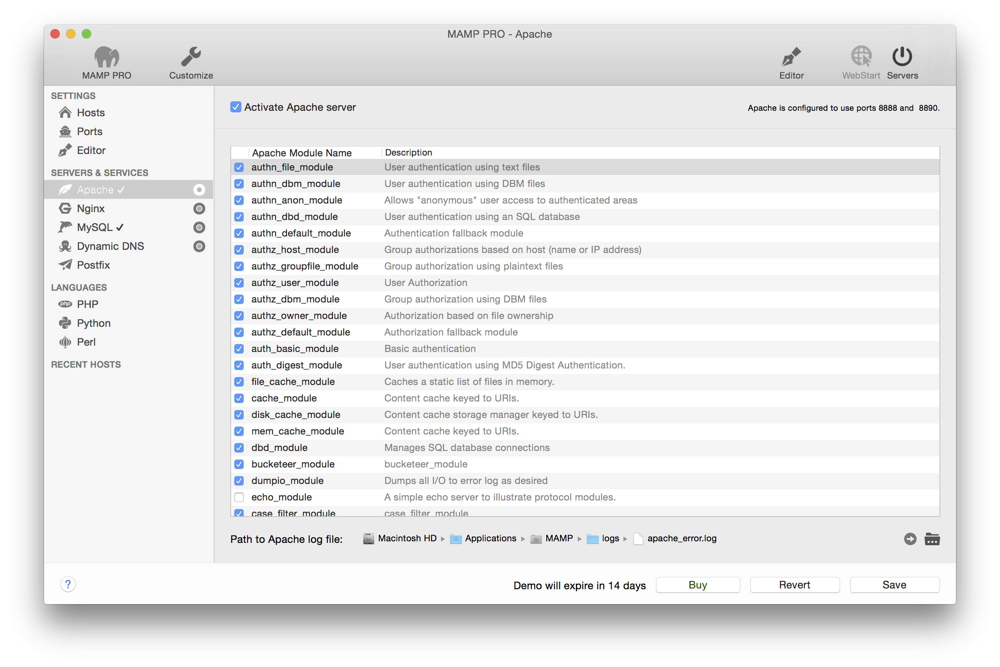

## Servers und Services > Apache

Der Apache-Web-Server von MAMP PRO wird mit zahlreichen Modulen ausgeliefert. Sie können nach Bedarf aktiviert oder deaktiviert werden. In der Spalte Kurzbeschreibung finden Sie Informationen zur Funktion des jeweiligen Moduls.

Beispiel: Möchten Sie die Skriptsprache PHP verwenden, dann muss PHP_module aktiviert sein. Möchten Sie Python nutzen, schalte Sie mod_wsgi Modul ein, für Perl perl_module. Wenn Sie den CGI-Modus verwenden möchten (um mehrere PHP-Versionen nutzen zu können), müssen Sie cgi_module aktivieren.

Bei Änderungen ist ein Neustart der MAMP PRO Server erforderlich.

---

*  **Path To Apache log file**

Errors occurring during execution of the Apache server will be saved in this log file.

