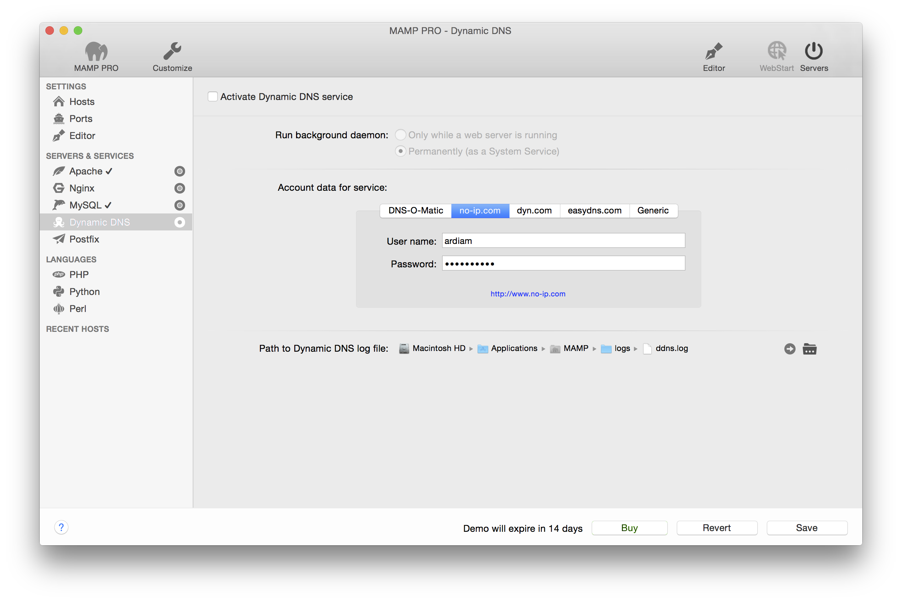

## Servers und Services > Dynamic DNS

Wenn Sie möchten, dass die virtuellen Hosts aus dem Internet heraus erreichbar sind (beachten Sie dabei diverse Sicherheitsaspekte), können Sie einen Dynamic DNS Service nutzen. 

Ist Ihr lokales Netzwerk über einen Router mit dem Internet verbunden, der Dynamic DNS bereits unterstützt, dann können Sie auf eine Dynamic DNS-Konfiguration innerhalb von MAMP PRO verzichten.

Ansonsten können Sie sich bei einem Dynamic DNS Service registrieren und anschliessend Ihren Benutzernamen und Passwort in die entsprechenden Felder eingeben. Zusätzlich können Sie einstellen, ob und wann der Dynamic DNS Service aktiviert werden soll.

Hinweis: Um diese Funktion nutzen zu können, müssen Sie sich bei einem der unterstützen Dienste registrieren. Diese sind unabhängig von MAMP PRO und kein Angebot der appsolute GmbH. Beachten Sie bitte, dass die Dienste für dyn.com und easydns.com nur für bereits bestehende Accounts unterstützt werden.

*  **Aktivieren der dynamischen Dienste**

Activate dyndns here.

---

*  **Run Background Daemon**

Nie (keine dynamischen DNS-Dienste nutzen)
Deaktiviert den Dienst Dynamic DNS.

Automatisch, wenn Apache startet und stoppt
Startet den Dienst Dynamic DNS mit dem Apache-Server.

Permanent (als System-Dienst im Hintergrund)
Startet den Dienst Dynamic DNS mit dem Betriebssystem.

---

*  **Benutzername**

Tragen Sie hier Ihren Benutzernamen ein, den Sie vom Betreiber Ihres Dynamic DNS Service erhalten haben.

*  **Passwort**

Tragen Sie hier das Passwort ein, das Sie vom Betreiber Ihres Dynamic DNS Service erhalten haben.

