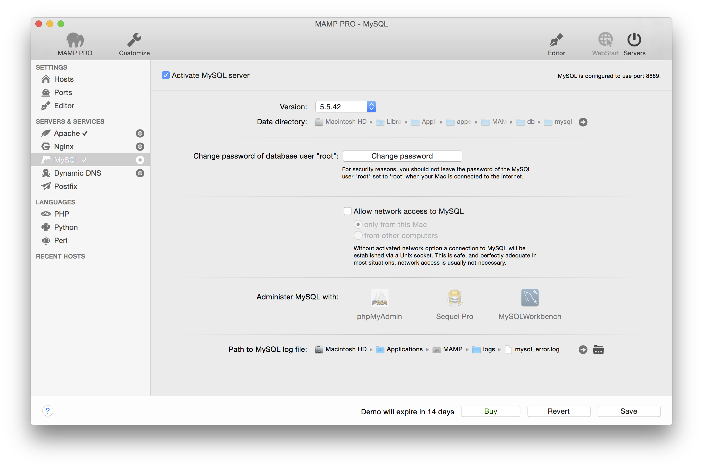

## Servers und Services > MySQL

MySQL ist ein weit verbreiteter Datenbankserver. MySQL wird von MAMP PRO auf Ihrem Computer installiert.

*  **Activate MySQL server**
   Check to activate the MySQL Server. When activated MySQL server will automatically start when the Servers button is pressed.

---

*  **Passwort des Benutzers “root” ändern**

Der Datenbankadministrator wird als root bezeichnet. Dieser Benutzer hat uneingeschränkten Zugriff auf alle Datenbanken. Daher sollten Sie ein sicheres Kennwort verwenden, das nur Ihnen bekannt ist.

 

Hinweis:Das Standardpasswort des Benutzers root lautet “root". Dieser Benutzer ist  nicht zu verwechseln mit dem Benutzer “root” von OS X. Sie können auch eines der MySQL -Administrationswerkzeuge verwenden, um einen weiteren MySQL-Benutzer anzulegen. Diesem könnten Sie dann eingeschränkte Rechte zuweisen.

---
*  **Netzwerkzugriffe auf MySQL erlauben**

Ist die Checkbox Netzwerkzugriff auf MySQL zulassen nicht aktiviert, dann wird der Zugriff auf MySQL via Netzwerk-Funktionen unterbunden. Solche Netzwerk-Zugriffe müssen nicht zwangsläufig von anderen Rechnern im Netzwerk kommen, auch andere Programme auf Ihrem Mac können über Netzwerk-Funktionen mit MySQL kommunizieren. Dies ist aber in der Regel unnötig, da lokale Programme ebenso über sogenannte sockets mit MySQL sprechen können.

 

Hinweis: Diese Option sollten Sie nur aktivieren, wenn es unbedingt nötig ist.

   *  **nur von diesem Rechner**

Nur Programme, die auf Ihrem Computer installiert sind, können über Netzwerk-Funktionen auf MySQL zugreifen.

 

   *  **auch von anderen Rechnern**

MySQL erlaubt alle Netzwerkzugriffe. Abhängig von Ihren Netzwerkeinstellungen können dies auch Zugriffe aus dem Internet sein.

--- 

*  **MySQL konfigurieren mit**

Zum Lieferumfang von MAMP PRO gehören einige MySQL-Administrationstools:

PHPMyAdmin ist eine webbasierte Administrationsoberfläche. Mit ihr können Sie Daten ändern und administrative Aufgaben durchführen, z.B. neue Datenbanken anlegen.

Sequel Pro ist eine native OS X-Anwendung für die MySQL-Administration. Zusätzlich zu den rein administrativen Aufgaben, erlaubt Ihnen Sequel Pro die Erstellung und Visualisierung von Datenbankschemata.

Auch MySQL Workbench ist eine native OS X-Anwendung für die MySQL-Administration, die ebenfalls Schemata Erstellen und Visualisieren kann.

--- 

*  **Pfad zur Logdatei von MySQL**

Hier legen Sie den Speicherort der MySQL-Logdatei fest. Alle Fehler, die beim Starten oder Ausführen des MySQL-Servers auftreten, werden in dieser Datei protokolliert.

