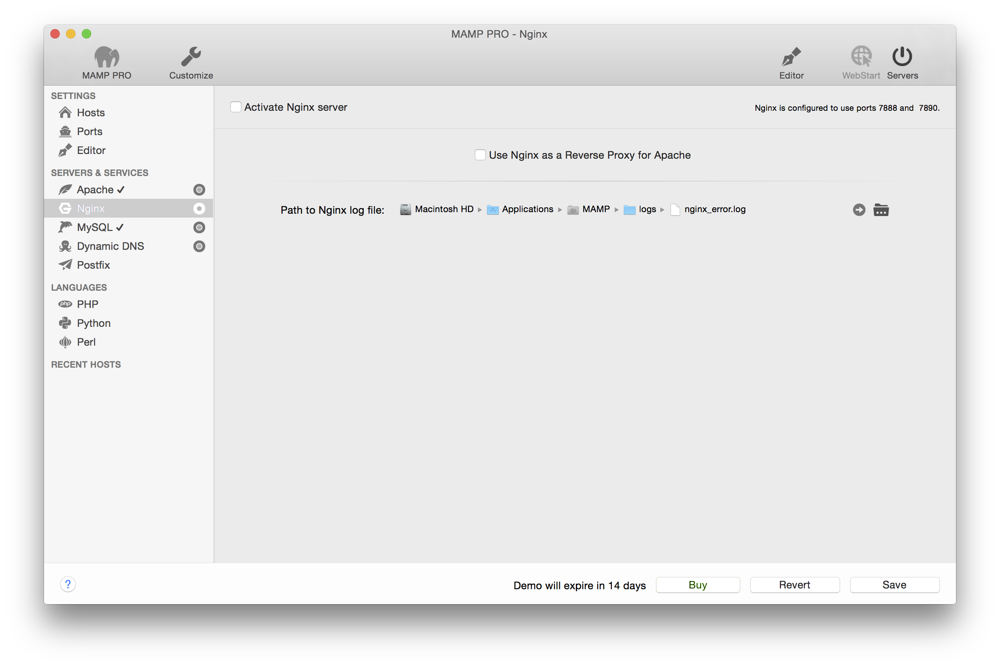

## Servers und Services > Nginx

The Nginx Web Server is a popular web server used in production environments. An instance of Nginx is installed on your Mac by MAMP PRO.

*  **Nginx Server Aktivieren**  

---

*  **Nginx als Reverse Proxy fur Apache Verwenden** 

---

*  **Nginx Modules**

The Nginx Web Server installed by MAMP PRO comes with several modules pre-installed.

The web server modules can be activated or deactivated depending on your needs. Module Description provides information pertaining to features and functions of the selected module.

---

*  **Nginx log Datei Pfad**  
