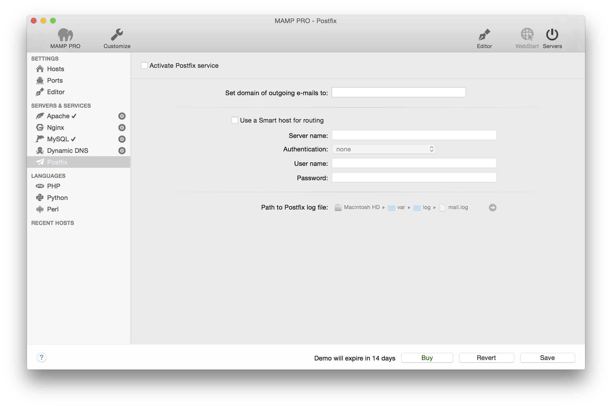

## Servers und Services > Postfix

Manchmal möchten Sie eine E-Mail per PHP senden, z. B. wenn Sie ein Kontaktformular auf Ihrer Webseite einbinden möchten. Um dies mit Hilfe von MAMP PRO abbilden und testen zu können, müssen Sie Postfix konfigurieren.

---

*  **Domain-Name für ausgehende Nachrichten**

Wenn Sie die PHP-Funktion mail () zum Senden von E-Mails an Ihre eigene E-Mail-Adresse (wie z. B. mail@meinedomain.com) verwenden möchten, gehen Sie in MAMP PRO zu Server -> Postfix und fügen Sie den Wert meinedomain.comin das Feld Domain der ausgehenden Post ein.

Möchten Sie die E-Mail an andere Personen und nicht an sich selbst versenden, dann müssen Sie Einen Smarthost zur Weiterleitung von E-Mails verwenden aktivieren und die folgenden Eingabefelder ausfüllen. Überprüfen Sie in diesem Fall unbedingt, ob Ihr E-Mail-Anbieter die Nutzung von Smart-Hosts unterstützt.

---

*  **Use a smart host for routing**  

    * **Server-Name**
    Geben Sie den Namen Ihres Servers für ausgehende E-Mails an. Dies könnte zum Beispiel smtp.meinedomain.com sein. Fragen Sie gegebenenfalls Ihren Provider, falls sie sich unsicher betreffend des Namens sein sollten.

   * **Authentifizierung**
   Geben Sie die Art der Authentifizierung für ausgehende E-Mails an. Fragen Sie gegebenenfalls Ihren Provider, falls sie sich unsicher betreffend der Art der Authentifizierung sein sollten.

   * **Benutzername**
   Tragen Sie den Benutzernamen Ihres E-Mail-Kontos ein.

   * **Passwort**
   Tragen Sie das Passwort für Ihres E-Mail-Kontos ein.

Hinweis: Einige Provider, wie z. B. Google Mail, unterstützen die Verwendung von Smarthosts nicht.

---
