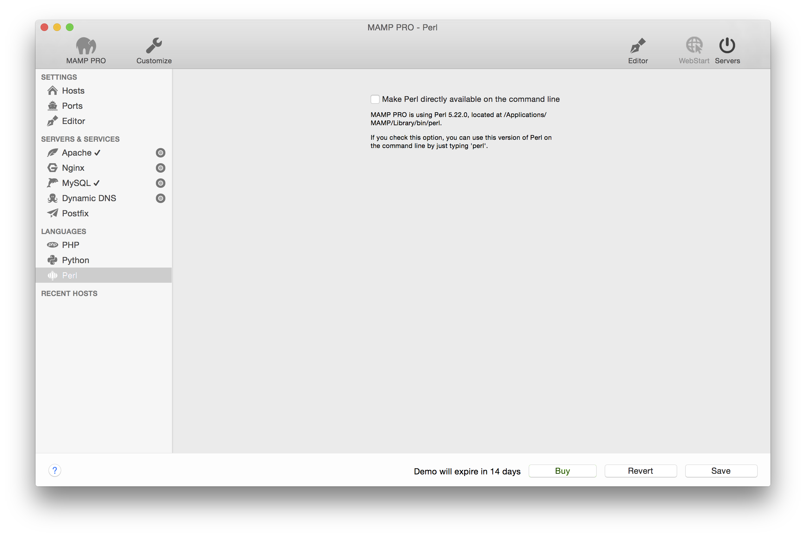

## Sprachen > Perl

Perl is a high-level, general-purpose, interpreted, dynamic programming language. A version 5 of Perl is included with MAMP PRO.

*  **Make Perl directly available on the command line**  
   If you check this option, you can use this version of Perl on the command line by just typing `perl`.
