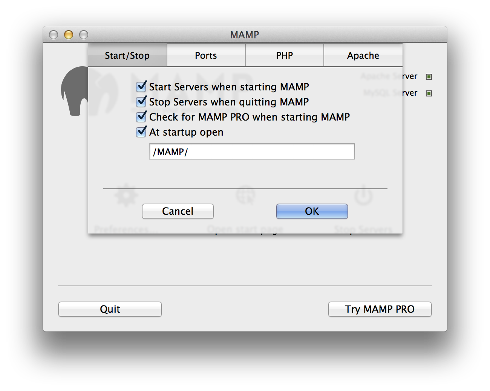
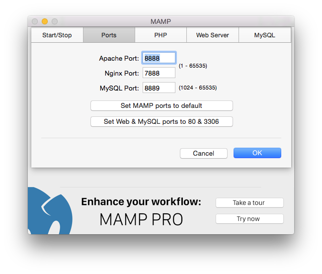
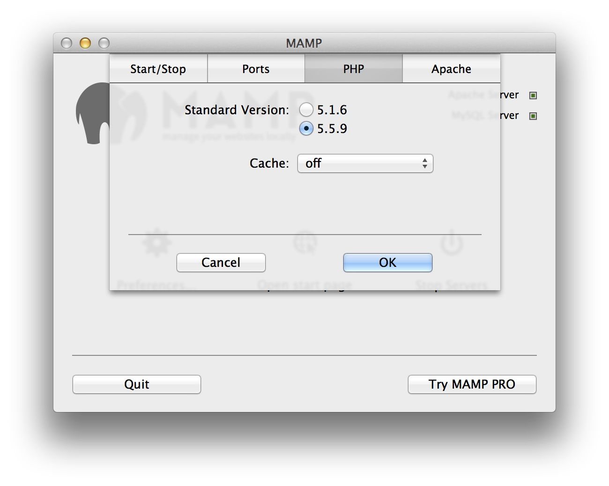
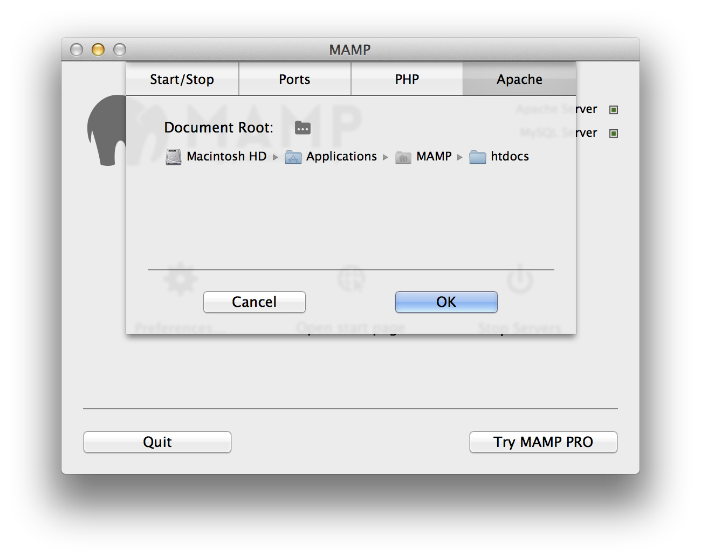

## Preferences

#### Start/Stop

*   **Start Servers**  
   The Apache and MySQL services will start automatically when you launch MAMP.
*   **Check for MAMP PRO**  
   You will be prompted whether you want to start MAMP or MAMP Pro when this option is selected.
*   **Open Webstart Page**  
   The Webstart page will automatically open at the startup of MAMP when you select this option. See the Open Webstart Page section for more information on the MAMP start page.
*   **Stop Servers**  
   The Apache and MySQL services will be stopped automatically when you quit MAMP.
*   **My Favorite Link**  
   A link to this address will appear on the top menu of your Webstart page.

#### Ports

Server programs, when addressed via the network, need to be assigned to a certain network port. This way, multiple server programs may run on one server machine. Every service has a default port: The Apache web server typically uses port 80, the MySQL database server utilises port 3306.

These ports are configurable. The default configuration for MAMP uses ports 8888 and 8889, and 7888 . That way, the MAMP servers can run alongside other servers installed on your Mac. Should ports 7888, 8888 or 8889 be in use by a different application, please change the values accordingly.

The button Set Apache & MySQL ports to 80 & 3306 will set the ports to the value commonly used on the internet. The button Set MAMP ports to default will reset the ports for Apache, Nginx and MySQL to 8888, 7888 and 8889.

If you want MAMP to be available via the Internet please make sure that the configured ports are opened in your firewall.

#### PHP

#### Web Server

#### Open WebStart Page
