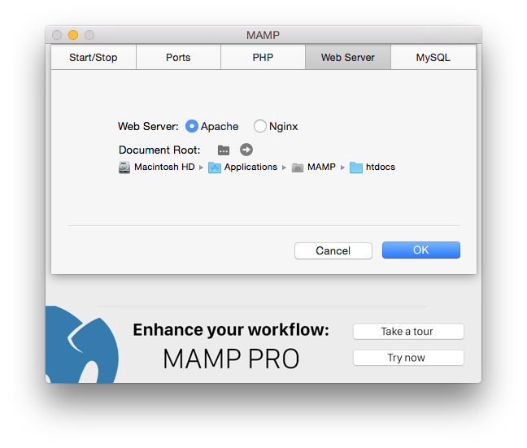

## Preferences

#### Start/Stop

*   **Start Servers**  
   The Apache and MySQL services will start automatically when you launch MAMP.
*   **Start Servers**  
   The Apache and MySQL services will start automatically when you launch MAMP.
*   **Start Servers**  
   The Apache and MySQL services will start automatically when you launch MAMP.
*   **Start Servers**  
   The Apache and MySQL services will start automatically when you launch MAMP.
*   **Start Servers**  
   The Apache and MySQL services will start automatically when you launch MAMP.
*   **Start Servers**  
   The Apache and MySQL services will start automatically when you launch MAMP.

#### Ports

#### PHP

#### Web Server

#### Open WebStart Page
