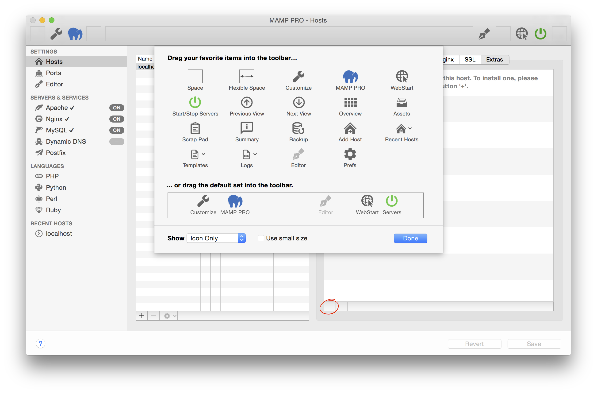

---
title: MAMP PRO (Mac) Documentation
description: 
layout: default-2
product: MAMP PRO Mac
language: en
---

## 7. Customize

Add your favorite short cuts the tool bar with the customize menu.

##### Space

##### Flexible Space

##### MAMP PRO
Open the MAMP PRO website.

##### Webstart
Open the Webstart page.

##### Start/Stop Servers
Start or stop the current active web and database servers.

##### Previous View
Revert to the previous screen on the main MAMP PRO window.

##### Next View
Return to the next view on the main MAMP PRO window.

##### Overview
A preview of your current web pages.

##### Summary
A summary of your all of your host, language and server settings.

##### Backup
Backup tool for your host and database settings.

##### Add Host
A short cut to the add host button.

##### Recent Hosts
A dropdown list of your recent hosts.

##### Templates
Quick access to your template files.

##### Logs
A dropdown menu of all of your log files.

##### Editor
Open the MAMP PRO Editor.

##### Prefs
A short cut to your MAMP PRO prefences.

##### Customize
Open the Customize window.

