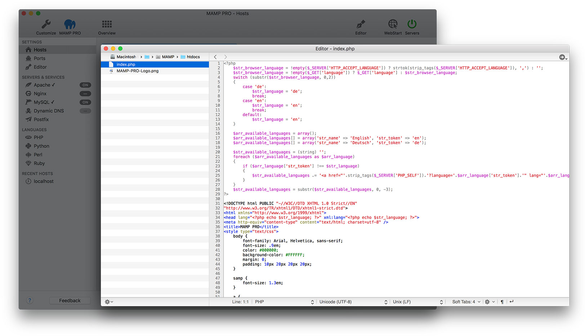
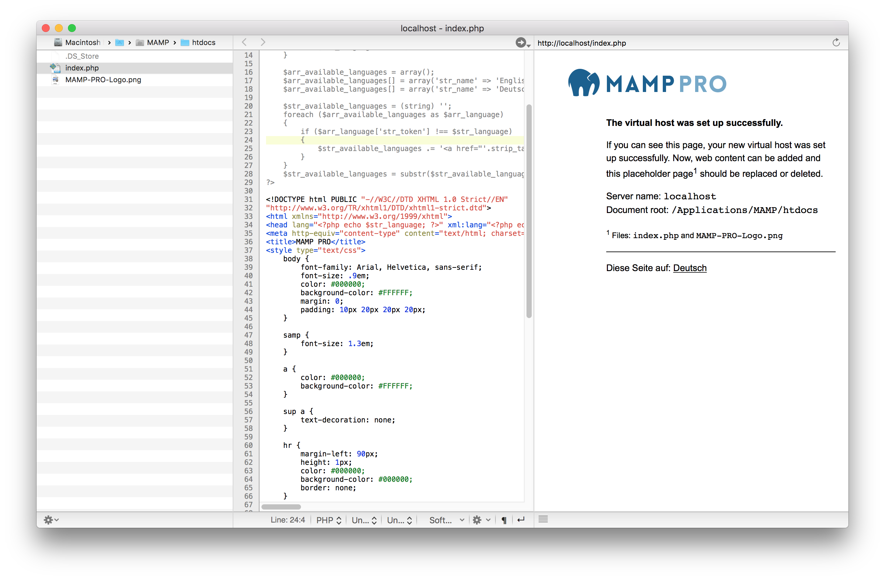
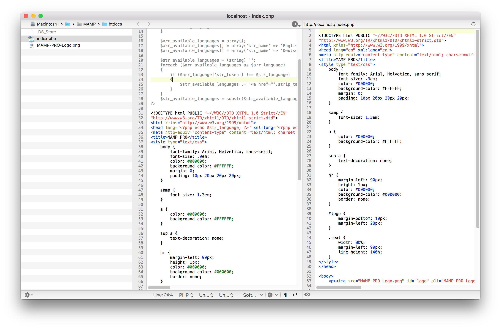
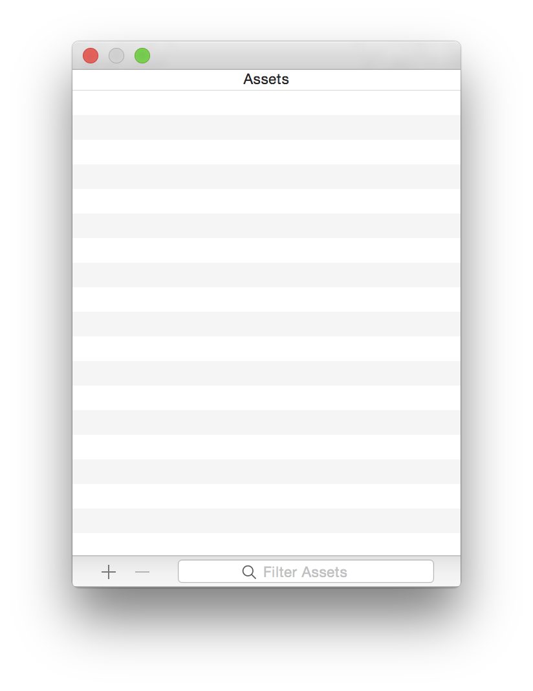

## Editor

Utilize the MAMP PRO Editor to edit your scripts directly in MAMP PRO. You can see your changes instantaneously in the live view, and your client side code in the real view.

---

You can adjust the setting for your editor [here](../Settings/Editor).

---

### Live View

The live view displays a live view of your website next to your server side code. 

Press the   button to display the live view. Right click on the Arrow button to display your site in a web browser.

---

### Real View

The real view displays the resulting client side view of your code next to your server side source code. 

Press the   button to display the live view.

Press the   button to switch back to the real view.

---

### Assets

Open the assets window through Window > Assets in the MAMP PRO menu. Use the assets window to keep often used icons, videos, files. Add items from the assets window by dragging them to the document root window. Your assets folder is located in `~/Documents/MAMP PRO/assets`.

