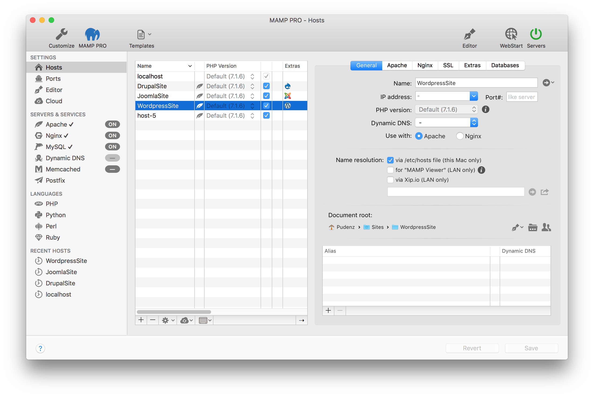

## First Steps

When the MAMP PRO application is launched for the first time its helper tools will be installed. You will be prompted to enter your admin password.

Click on the Servers button in the title bar to launch Apache and MySQL, they are your default GroupStart web and database servers. The launch status of the server is displayed in the Servers & Services section. A check mark next to the server/service indicates that this server/service will start/stop when the Servers button is pressed.  The Apache web server (default web server) uses port 8888 by default. This port must be specified when calling the local web page in the browser, e.g.: http://localhost:8888

Your default host for MAMP PRO is `localhost`. The files for localhost are initially located in the `/Applications/MAMP/htdocs` folder. See the [Hosts](../Settings/Hosts/General) section for more information on what a host is and how to create additional hosts.

---

### Main GUI Elements

*  **Customize**  
   Customize your toolbar. Additional information about the toolbar can be found in the [Customize](../Customize/) section.
*  **MAMP PRO**  
   Open the  [https://mamp.info](https://www.mamp.info){:target="_blank"} web page.
*  **Editor**  
   Open the MAMP PRO Editor. Additional information about the MAMP PRO Editor can be found in the [Editor](../Editor/)     section.
*  **WebStart**  
   Open the MAMP PRO start page of your local web server.
   Additional information about the MAMP PRO start page is in the [Webstart](../WebStart) section.
*  **Servers**  
   Starts the current GroupStart services of MAMP PRO. Stops all services if any GroupStart services are already running. 
*  **Revert**  
   Discards all changes, which have not already been confirmed with `Save`.
*  **Save**  
   Save your changed settings.

---

### Meaning of Icons

 Change a file location, including the location of the document root, or a log file. 

 Prepare an e-mail with the Xip.io URL of a host.

 Modify the access rights of a document root folder.

 Open a disk location in the Finder, or a host in the web browser.

 Provide more information, including phpInfo().

 Indicates that information is missing.

 Add a new PHP version.
