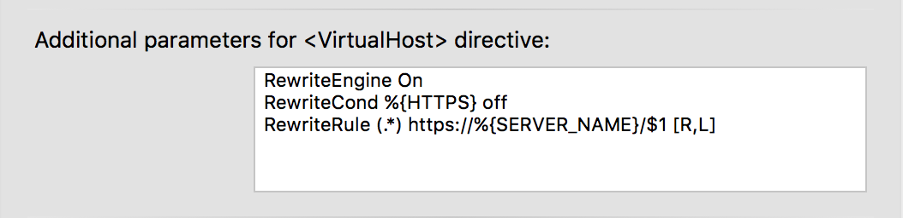
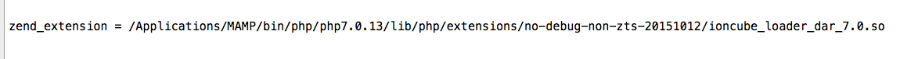
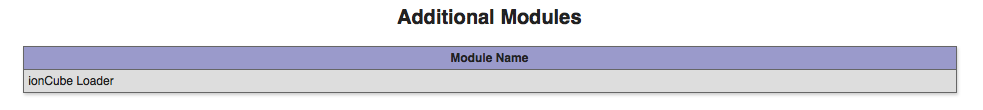

## How Tos > General

### Activating Output Buffering

1. Start MAMP PRO
2. Select File -> Edit Template -> PHP 5.x.x php.ini / PHP 5.x.x php.ini 
3. Search this line  
   `output_buffering = Off`
4. Change `Off` to `On` or to a maximum number of bytes instead (for example `4096`)
5. Save the file
6. Start servers

---

### Increase the PHP memory limit

1. Start MAMP PRO
2. Stop the server if it's running 
3. Choose Menu > File > Edit Template > PHP 5.x.x php.ini / PHP 5.x.x php.ini
4. The PHP ini file will be opened.
5. If a dialogue box pops up, read it and confirm with OK
6. Search (<kbd>Command</kbd> + <kbd>F</kbd>) for `memory_limit`
7. You should get the following line:  
   `memory_limit = 32M ; Maximum amount of memory a script may consume (8M)' 
8. Now you can change the default value of `32M`. For instance into `64M` or even more (like `128M`)
9. Save (<kbd>Command</kbd> + <kbd>S</kbd>) your changes.
10. Close (<kbd>Command</kbd> - <kbd>W</kbd>) the file.
11. Start the Server.

---

 

### Show the Postfix log file With a text editor 

Note: If you want to open the Postfix log file with a text editor, you have to make the file visible.

1. Open the Terminal.app (Applications/Utilities)
2. Enter the following and hit enter:  
   `defaults write com.apple.finder AppleShowAllFiles -boolean true`
3. Restart the Finder by enter the following and hit enter:  
   `killall Finder`
4. Open the file /private/var/log/mail.log with your editor.

---

### Show the Postfix log file with Console.app (recommended)

1. Open Console.app (Applications/Utilities)
2. Choose View -> Show Log List
3. Open the folder "FILES" in the Log List
4. Open the folder /private/var/log
5. Click the mail.log entry in the Log List
6. On the right side of the window you can see the content of the Postfix log file.

---

### Show Postfix log file using command line

1. Open the Terminal.app (Applications/Utilities)
2. Enter the following prompt and hit enter  
   `tail -f /private/var/log/mail.log`
3. You can now read the Postfix log file within the Terminal. The log file keeps updating as new entries apply.
4. Press <kbd>Ctrl</kbd> + <kbd>C</kbd> to stop the process.

---

### Set up a host to be both http and https

You can get an identical http and https host by creating two hosts.

Note: When using MAMP PRO 4.06 or later you need to press ALT and '+' when creating these two hosts.

1. Set up a http host with the name "MyHost" using document root "MyDocumentRoot".
2. Set up a https host (SSL) with the name "MyHost" using document root "MyDocumentRoot".

You will get warning message stating you are using the same document root and name for multiple hosts. These hosts will appear in red.

---

### Redirect http traffic to https site using MAMP PRO interface

1. Go to your Settings > Hosts > Apache tab in MAMP PRO.
2. Add the following lines to your Additional Parameters for <Virtual Host> directive:

---

### Redirecting http traffic to https site using .htaccess file

1. Create a .htaccess file using the MAMP PRO Editor and save this file in your document root.
2. Add the following lines to your .htaccess file.



<ifmodule mod_rewrite.c="">  
RewriteEngine On   
RewriteCond %{HTTPS} off    
RewriteRule (.*) https://%{HTTP_HOST}%{REQUEST_URI} [R=301,L]    
</ifmodule>    



---

### Create a host using the command line

You can create a host using the command by using the following steps

1. Quit MAMP PRO.
2. Open Terminal.app ( /Applications/Utilities ).
2. Enter the following line into the terminal and hit enter:  
   `/Applications/MAMP\ PRO/MAMP\ PRO.app/Contents/MacOS/MAMP\ PRO cmd createHost testHost /Applications/MAMP/htdocs2`
   
This will create a host with the name 'TestHost', with a document root of '/Applications/MAMP/htdocs2'. MAMP PRO will briefly open, and a host will be created. MAMP PRO will then quit. When you open MAMP PRO you will see your new host.

---

### Create a host and database using the command line 

You can create a host and corresponding database for this host using the command line. Use the following steps.

1. Quit MAMP PRO.
2. Open Terminal.app ( /Applications/Utilities ).
3. Enter the following command and hit enter:
   `/Applications/MAMP\ PRO/MAMP\ PRO.app/Contents/MacOS/MAMP\ PRO cmd startServers`
4. Enter the following line into the terminal and hit enter:  
   `/Applications/MAMP\ PRO/MAMP\ PRO.app/Contents/MacOS/MAMP\ PRO cmd createHost testHost /Applications/MAMP/htdocs2 testDB`
5. Enter the following command and hit enter:
   `/Applications/MAMP\ PRO/MAMP\ PRO.app/Contents/MacOS/MAMP\ PRO cmd stopServers`
   
This will create a host with the name 'TestHost', with a document root of '/Applications/MAMP/htdocs2', and a database named 'testDB'. MAMP PRO will briefly open both when the servers are started, stopped, as well as when the host is created. MAMP PRO will then quit again each time. When you re open MAMP PRO you will see your new host and database.

---

### Install ionCube

This example uses PHP 7.0.13. Please be aware if you are installing ionCube for a different PHP version you will need to use a different ionCube file version (dar_5.6 instead of dar_7.0) and install to the corresponding PHP version directory ( phpXXX instead of php7.0.13 ).

1. Download the OS X (64 bits) tar.gz version of [ionCube](http://downloads3.ioncube.com/loader_downloads/ioncube_loaders_dar_x86-64.tar.gz){:target="_blank"}. 
2. Unpack ioncube_loaders_darx86-64.tar.gz . In your resulting `ioncube` directory there will be several files. Copy only the ioncube_loader_dar_7.0.so file to `/Applications/MAMP/bin/php/php7.0.13/lib/php/extensions/no-debug-non-zts-20151012`. The ioncube_loader_dar_7.0.so is good for all PHP 7.0.x versions.
3. Add the following line to your php 7.013 template file. You can reach your template files in MAMP PRO through the menu bar, File > Edit Template > PHP > 7.0.13 . Be sure this line is above all other Zend directives.
zend_extension = /Applications/MAMP/bin/php/php7.0.13/lib/php/extensions/no-debug-non-zts-20151012/ioncube_loader_dar_7.0.so

4. Restart your servers in MAMP PRO.
5. To verify ionCube is loaded use your php.ini file. You should see the following in your php.ini file.

