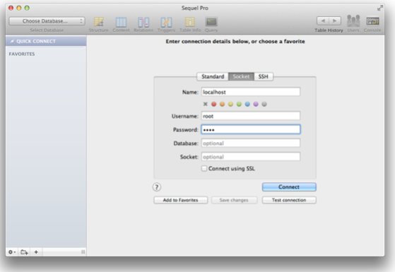
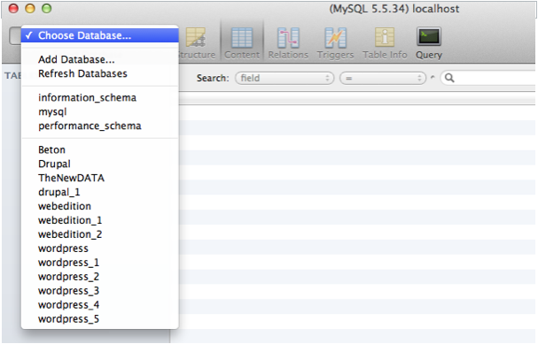

## How Tos

### Activating Output Buffering

1. Start MAMP PRO
2. Select File -> Edit Template -> PHP 5.x.x php.ini / PHP 5.x.x php.ini 
3. Search this line  
   `output_buffering = Off`
4. Change `Off` to `On` or to a maximum number of bytes instead (for example `4096`)
5. Save the file
6. Start servers

---

### Check the Default Storage Engine of MySQL

1. Open MAMP
2. Start the servers
3. Open Terminal.app (/Applications/Utilities)
4. Enter the following line into the terminal and hit enter:  
   `cd /Applications/MAMP/Library/bin`
5. Enter the following line into the terminal and hit enter:  
   `./mysql --host=localhost -u root -proot`
6. Enter the following line into the MySQL prompt and hit enter:  
  `USE information_schema;`
7. Enter the following line into the MySQL prompt and hit enter:  
   `SELECT * FROM engines;`
8. A table with the Storage Engines of MySQL will show up. Inside the Support column the Default Storage Engine
   has the value `DEFAULT`.
9. Enter the following line into the MySQL prompt and hit enter:  
   `exit;`

---

### Increase the PHP memory limit

1. Start MAMP PRO
2. Stop the server if it's running 
3. Choose Menu > File > Edit Template > PHP 5.x.x php.ini / PHP 5.x.x php.ini
4. The PHP ini file will be opened.
5. If a dialogue box pops up, read it and confirm with OK
6. Search (<kbd>Command</kbd> + <kbd>F</kbd>) for `memory_limit`
7. You should get the following line:  
   `memory_limit = 32M ; Maximum amount of memory a script may consume (8M)' 
8. Now you can change the default value of `32M`. For instance into `64M` or even more (like `128M`)
9. Save (<kbd>Command</kbd> + <kbd>S</kbd>) your changes.
10. Close (<kbd>Command</kbd> - <kbd>W</kbd>) the file.
11. Start the Server.

---

### Set the MySQL Default Storage Engine

The MySQL server of MAMP PRO uses the Default Storage Engine MyISAM. If you want to change this, you have to change the configuration file of the MySQL server. With this tutorial we want to show you how to manage this. As Default Storage Engine we are using InnoDB.

1. Start MAMP PRO.
2. Stop the MAMP PRO server if it is running. 
3. Select File > Edit Template > MySQL my.cnf 
4. An editor window appears.
5. If a warning message appears confirm with OK.
6. Find the section `[mysqld]`
7. Beneath the last line of this section add this line:  
   `default-storage-engine = InnoDB`
8. The section `[mysqld]` now looks like this:  
   IMAGE
9. Save (<kbd>Apple</kbd> + <kbd>S</kbd>) all changes made on "my.cnf"
10. Close the editor window (<kbd>Apple</kbd> + <kbd>W</kbd>)
11. Start the MAMP PRO servers.

---
 

### Show the Postfix log file With a text editor 

Note: If you want to open the Postfix log file with a text editor, you have to make the file visible.

1. Open the Terminal.app (Applications/Utilities)
2. Enter the following and hit enter:  
   `defaults write com.apple.finder AppleShowAllFiles -boolean true`
3. Restart the Finder by enter the following and hit enter:  
   `killall Finder`
4. Open the file /private/var/log/mail.log with your editor.

---

### Show the Postfix log file with Console.app (recommended)

1. Open Console.app (Applications/Utilities)
2. Choose View -> Show Log List
3. Open the folder "FILES" in the Log List
4. Open the folder /private/var/log
5. Click the mail.log entry in the Log List
6. On the right side of the window you can see the content of the Postfix log file.

---

### Show Postfix log file using command line

1. Open the Terminal.app (Applications/Utilities)
2. Enter the following prompt and hit enter  
   `tail -f /private/var/log/mail.log`
3. You can now read the Postfix log file within the Terminal. The log file keeps updating as new entries apply.
4. Press <kbd>Ctrl</kbd> + <kbd>C</kbd> to stop the process.

---

 

### Connect to MySQL from PHP (PHP <= 5.5.x)



$user = 'root';
$password = 'root';
$db = 'inventory';
$host = 'localhost';
$port = 8889;

$link = mysql_connect(
   "$host:$port", 
   $user, 
   $password
);
$db_selected = mysql_select_db(
   $db, 
   $link
);



or using an UNIX Socket:



$user = 'root';
$password = 'root';
$db = 'inventory';
$socket = 'localhost:/Applications/MAMP/tmp/mysql/mysql.sock';

$link = mysql_connect(
   $socket, 
   $user, 
   $password
);
$db_selected = mysql_select_db(
   $db, 
   $link
);



---

 

### Connect to MySQL from PHP (PHP >= 5.6.x)



$user = 'root';
$password = 'root';
$db = 'inventory';
$host = 'localhost';
$port = 8889;

$link = mysqli_init();
$success = mysqli_real_connect(
   $link, 
   $host, 
   $user, 
   $password, 
   $db,
   $port
);



or using an UNIX Socket:



$user = 'root';
$password = 'root';
$db = 'inventory';
$host = '127.0.0.1';
$port = 8889;
$socket = 'localhost:/Applications/MAMP/tmp/mysql/mysql.sock';

$link = mysqli_init();
$success = mysqli_real_connect(
   $link, 
   $host,
   $user, 
   $password, 
   $db,
   $port,
   $socket
);



---

### How To Connect To MySQL using Python 



import mysql.connector

config = {
  'user': 'root',
  'password': 'root',
  'host': 'localhost:8889',
  'database': 'inventory',
  'raise_on_warnings': True,
}

link = mysql.connector.connect(**config)



or using an UNIX Socket:



import mysql.connector

config = {
  'user': 'root',
  'password': 'root',
  'unix_socket': '/Applications/MAMP/tmp/mysql/mysql.sock',
  'database': 'inventory',
  'raise_on_warnings': True,
}

link = mysql.connector.connect(**config)



---

 

### Connect To MySQL using Perl 



use DBI;
 
my $user = 'root';
my $password = 'root';
my $db = 'inventory';

my $link = DBI->connect(
   "DBI:mysql:database=$db", 
   $user, 
   $password
);



or connecting via network:



use DBI;
 
my $user = 'root';
my $password = 'root';
my $db = 'inventory';
my $host = 'localhost';
my $port = 8889;

my $link = DBI->connect(
   "DBI:mysql:database=$db;host=$host;port=$port", 
   $user, 
   $password
);



### Connect to MySQL using Sequel Pro

1. Sequel Pro can be launched via the MAMP PRO interface in the ‘MySQL’ tab. Click on the Sequel Pro icon at the bottom of the tab. The instance of Sequel Pro launched from the MAMP PRO interface resides in your Applications/MAMP folder. If your MAMP PRO download package did not come with Sequel Pro you can download it here.

2. To connect to your databases you have to fill in several required fields. Navigate to the ‘Socket’ tab.

   

   *  **Name:** This is the host name. The default host is ‘localhost’.

   *  **Username:** This is your MySQL username. Your MySQL username will be ‘root’ if you have not changed the default             username setup in MAMP PRO.

   *  **Password:** This is your MySQL password.Your MySQL username password will be ‘root’ if you have not changed the             default password setup in MAMP PRO.

3. Press Connect.

4. You can access your individual databases by clicking on the ‘Choose Database…’ Drop down menu.

   

---

### How To Transfer Your Databases From MAMP To MAMP PRO 

1. Stop your servers and close any instances of MAMP and MAMP PRO.
2. Open your Mac Finder and navigate to `/Library/application data/appsolute/MAMP PRO`.
3. Rename your `/db` folder to `/db_bak`.
4. Open MAMP PRO and launch your servers.

When MAMP PRO launched it's servers it (re) copied database data from the MAMP location to the MAMP PRO location because it did not detect a `/Library/application data/appsolute/MAMP PRO/db` folder. You should now be looking at your current database data.

