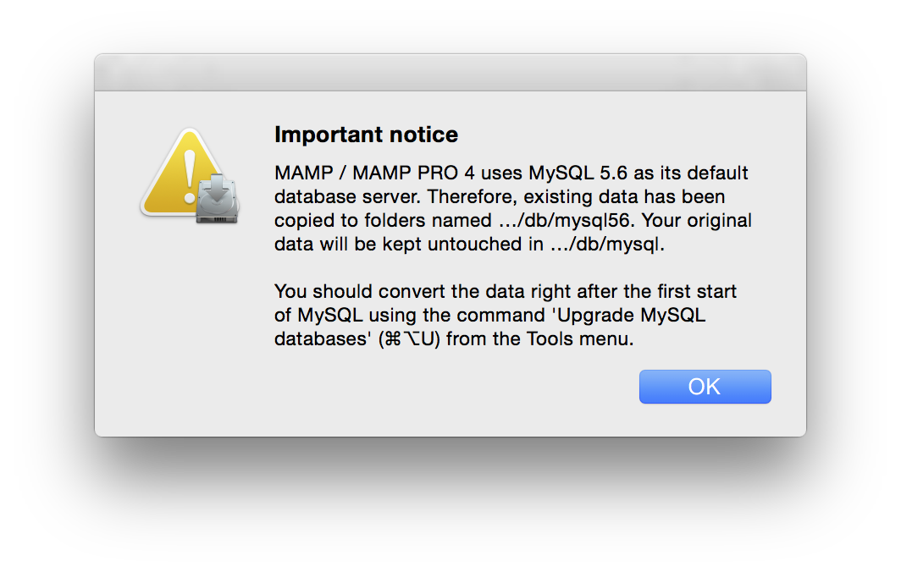

## MAMP PRO 3.xx to 4.xx Upgrade

When up upgrading to MAMP PRO 4 your data willl be upgraded to MySQL 5.6. Your current MySQL data will be copied from `/Library/Application Support/appsolute/MAMP PRO/db/mysql` to  `/Library/Application Support/appsolute/MAMP PRO/db/mysql56`. Your old data will be preserved intact in  `/Library/Application Support/appsolute/MAMP PRO/db/mysql`.

1. Download MAMP PRO from [www.mamp.info](https://www.mamp.info){:target="_blank"} .
2. Double click on the `MAMP_MAMP_PRO_4.xx.pkg` file in your `Downloads` folder to start the installation process.
3. If the installer detects an existing `/Applications/MAMP` folder it will rename it to `/Applications/MAMP_current_date`.
4. Your existing `htdocs` folder will be moved to your new `/Applications/MAMP` folder.
5. Confirm that all data has been transferred correctly before starting MAMP PRO.
6. If you were using MySQL 5.5 (most likely scenerio) you will be informed of the upgrade to MySQL 5.6 . 

 

The installation process will create an `/Applications/MAMP_current_date` folder. This folder can now be deleted. You may however keep it, so you can fall back to your original setup.
