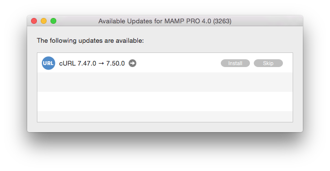

## In-App Updates

You can update several components directly through the MAMP PRO interface using the In App Update screen. Quit and restart MAMP PRO when you are finished downloading a new component.

*  **MAMP PRO**  
    Upgrade your entire MAMP PRO installation. A MAMP_MAMP_PRO.pkg file will be downloaded to your Dowloads folder.

*  **PHP**  
    Add an additional version of PHP.

*  **phpMyAdmin**  
    Update your phpMyAdmin. Your existing phpMyAdmin will be updated.

*  **OpenSSL**  
    Update your OpenSSL. Your existing instance of OpenSSL will be updated.

