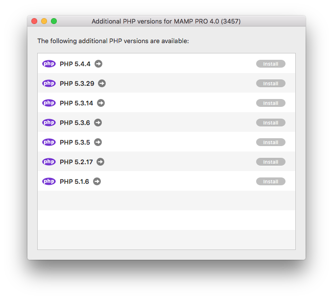

## In-App Updates

You can update several components directly through the MAMP PRO interface using Updates. To update MAMP PRO, phpMyAdmin, OpenSSL and more go to [MAMP PRO > Check for Updates ...](../../Menu/MAMP-PRO/#check_for_udpates)

You can install additional versions of php versions directly from the [PHP tab](../../Languages/PHP).

