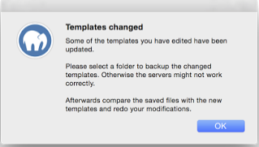

## Installation

### Installation requirements

To use MAMP PRO, your system must meet the following requirements:

- A working MAMP installation (MAMP can be downloaded directly with the MAMP PRO installation package).
- Apple OS X, version 10.8.0 or later.
- A Mac with a 64-Bit-capable CPU.
- A user account that is part of the Admin Group. Go to Preferences > Users & Groups to confirm this.

### Installing and upgrading MAMP PRO

1. Download MAMP PRO from https://www.mamp.info.
2. Double click on the `MAMP_MAMP_PRO_4.0.pkg` file in your `Downloads` folder.
3. The System Installer will guide you through the installation process.
4. If the installer detects an existing `MAMP` folder it will rename the current MAMP folder to `MAMP_current_date`.
5. An existing `htdocs` folder will be moved to your new `/Applications/MAMP` folder.
6. If there has been a change to the configuration of Apache, PHP, or MySQL (A directive was modified or a new one added)    between versions of MAMP PRO and you have already made changes to your current configuration (resulting in the creation of a template file in ~/Library/application support/appsolute/MAMP PRO/templates ), MAMP PRO will ask you to save off your old templates when you upgrade.

Save your template files. You can use these saved template files as a guide of your previous modifications. New (re)modifications need to be made through the MAMP PRO interface (File > Edit Templates), just as you had done before in your previous version of MAMP PRO.

7. Confirm that all data has been transferred correctly before starting MAMP PRO.
8. Your `/Applications/MAMP_current_date` folder can now be deleted. You may however keep it, so you can fall back to your original setup.

Note: You need administrator permissions to install MAMP PRO!

### Uninstall

Use the MAMP PRO Uninstaller located in `/Applications/MAMP PRO` to remove MAMP PRO.

Note: Using the uninstaller in `/Applications/MAMP PRO` will remove your databases located in `/Library/Application Support/appsolute/MAMP PRO/db`

Drag the `/Applications/MAMP` folder to the `Trash` to complete uninstallation.

