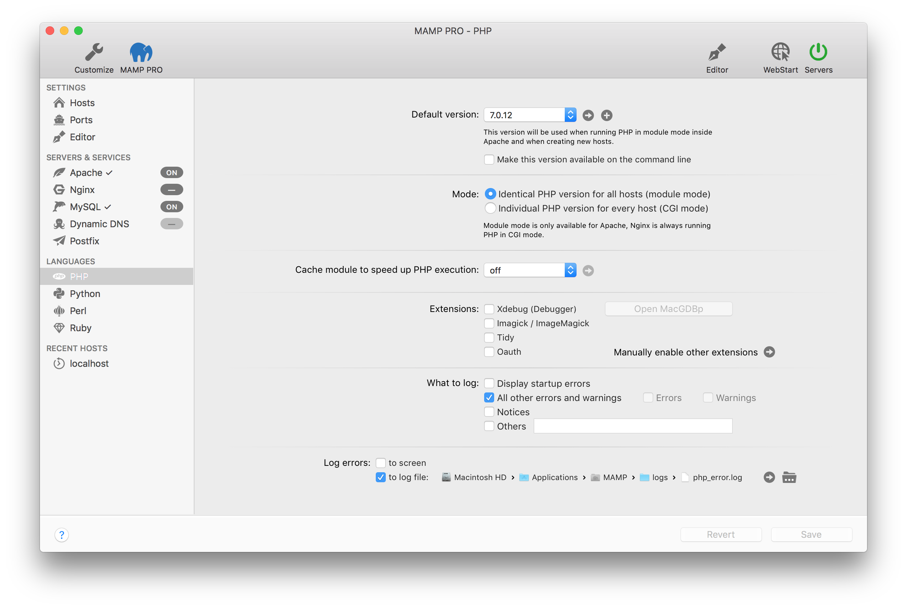

## Languages > PHP

PHP is a popular web scripting programming language. MAMP PRO installs several versions of the PHP script interpreter.

---

*  **Default version**  
   Select which PHP version will be the default version. To view the [php template file](../../Menu/File) press the  button. Additional versions of php can be downloaded by pressing the 'Plus' button.

   

    *  **Make this version available on the command line**  
   Choose this to make the current version available on the command line.

---

*  **Mode**  
   Choose whether to use identical PHP versions for all hosts (module mode) or on a host by host basis (CGI mode).  

    *  **Identical PHP versions for all hosts (module mode)**  
       In module mode all hosts use the same PHP version.
    *  **Individual PHP version for every host (CGI mode)**  
       In CGI Mode the PHP settings will be identical for all hosts – except for the PHP version.
       Navigate to the Hosts section to change the PHP version for each individual host.
       More information on how to [change the PHP version for an individual host](../../Settings/Hosts/General#php_version)         is covered in the Settings > Hosts > General section.  

---

*  **Cache module to speed up PHP execution**  
   PHP has several cache extensions that can help speed up execution in certain circumstances.
   This is set to "off" by default. Enabling a cache extension does not necessarily translate into greater execution speed.     A particular cache is not available for the current PHP version if it is not enabled.  

    *  **off**  
         No cache will be used.
   *  **APC**  
         The Alternative PHP Cache (APC) is a free and open opcode cache for PHP. You can learn more about APC here{:target="_blank"}
   *  **eAccelerator**  
         eAccelerator a free open-source PHP accelerator & optimizer. You can learn more about eaccelerator [here](http://eaccelerator.net){:target="_blank"}.
   *  **XCache**  
         XCache is a open-source opcode cacher. You can learn more about xCache [here](https://xcache.lighttpd.net){:target="_blank"}.
   *  **OPCache**  
         OPcache improves PHP performance by storing precompiled script bytecode in shared memory, thereby removing the need for PHP to load and parse scripts on each request. You can learn more about OPcache  [here](http://php.net/manual/en/book.opcache.php){:target="_blank"}.
   
    
   
   Several caches provide a user interface to help analyze and profile your code. Press the  button to the right of the cache name to view this interface. An interface is not available if the Arrow button is not enabled.

---

*  **Debugger**  

    *  **Activate Xdebug**  
       Activate Xdebug to allow PHP to create debugging information during script execution.
       By default, Xdebug uses localhost and port 9000 in the PHP.ini file.

    *  **Open MacGDBp**  
       With Xdebug activated you can open the MacGDBp debugger to enable PHP debugging.
       By default, MacGDBp expects debugging information on port 9000 of localhost.

---

*  **What to log**  
   Determine which error types should be reported.  

    *  **Display startup errors**  
       Log PHP errors that occur when Apache loads the PHP module.  

    *  **All errors and warnings**  
       All errors will be reported.  

    *  **Errors**  
       Script errors that make the further execution of the current PHP script impossible.  

    *  **Warnings**  
       General errors in the PHP environment.  

    *  **Notices**  
       Possible problems, that do not concern PHP, but which could be a notice of an error in a script.  

    *  **Other**  
       Report further error types through constants. Please turn to the PHP documentation for further information.

---

*  **Log Errors**  
   Determine if errors should be recorded in a log file and/or displayed in a web browser window.

More information on how to [connect to MySQL using PHP (PHP <= 5.5.x)](../../How-Tos/#php_connect_mysql) can be found in our How To section.

More information on how to [connect to MySQL using PHP (PHP >= 5.6.x) ](../../How-Tos/#php_connect_mysqli) can be found in our How To section.

