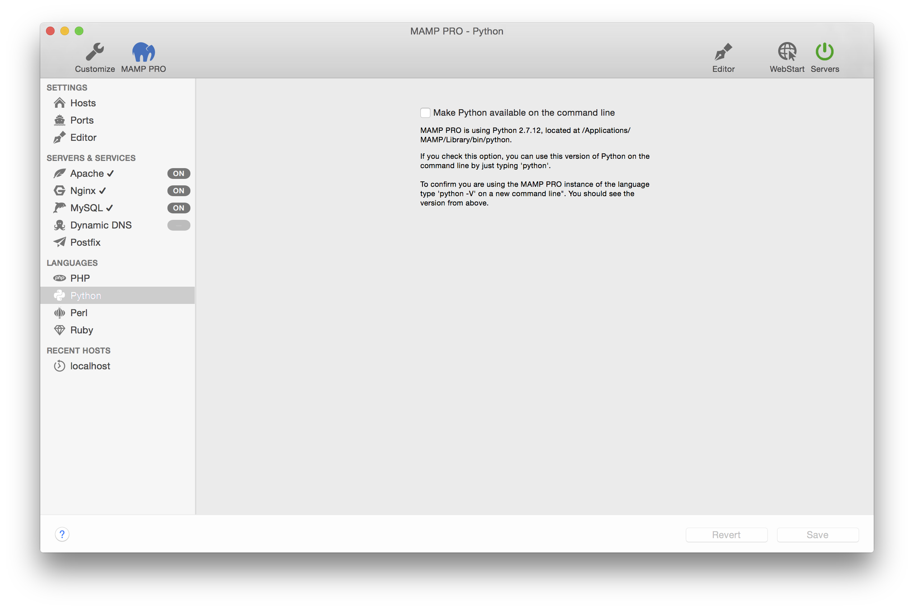

## Languages > Python

Python is a widely used high-level, general-purpose, interpreted, dynamic programming language. 

---

*  **Make Python directly available on the command line**  
   If you check this option, you can use this version of Python on the command line by just typing `python`.

More information on how to [connect to MySQL using Python](../../../Menu/File#edit_templates) can be found in our How To     section.
