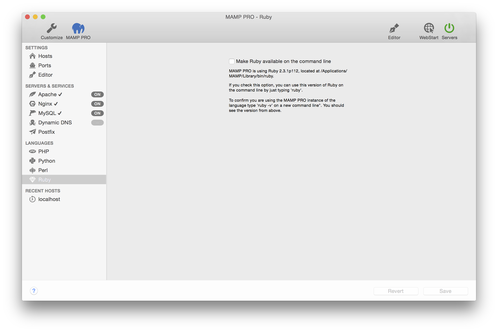

## Languages > Ruby

Ruby is a dynamic, reflective, object-oriented, general-purpose programming language. 

---

*  **Make Ruby directly available on the command line**  
   If you check this option, you can use this version of Ruby on the command line by just typing `ruby`.

