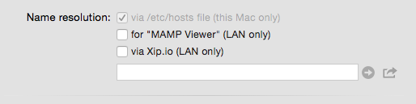
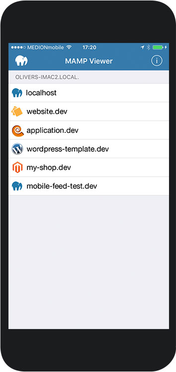

## MAMP Viewer

In order to make your individual host visible in the MAMP Viewer you must activate it on the [Hosts > Settings > General](../Settings/Hosts/General/#mamp_viewer) Tab  . Restart your servers to enable viewing in MAMP Viewer.

Preview your work using the MAMP Viewer available on iOS.

---

### FAQ

Q: My Magento Site will not show up on the MAMP Viewer?
A: The MAMP PRO Viewer does not support  Magento  installations.

