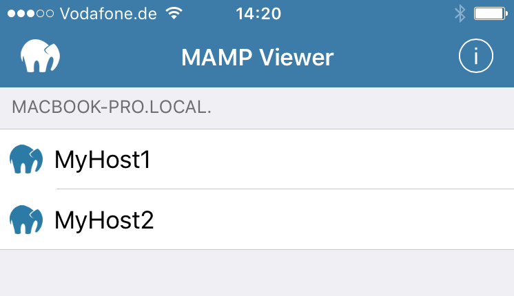

## MAMP Viewer

In order to make your individual host visible in the MAMP Viewer you must activate it on the Hosts > Settings > General Tab [here](../Settings/Hosts/General) . Restart your servers to enable viewing in MAMP Viewer.

Preview your work using the MAMP Viewer available on iOS.

