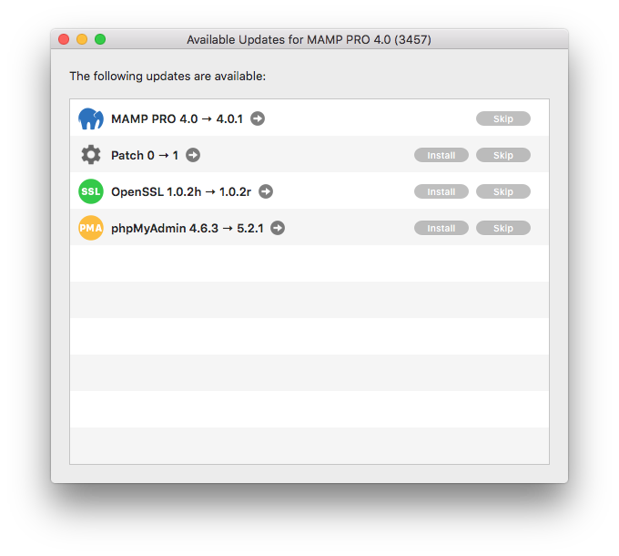
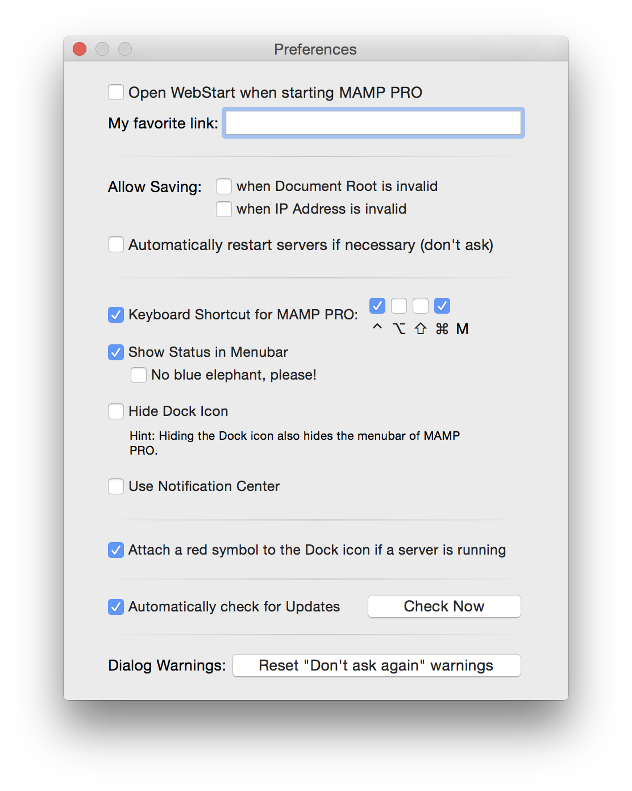

## MAMP PRO

### About MAMP PRO

Check your version number and MAMP PRO key.

---

### Register MAMP PRO

Register your MAMP PRO.

---

### Check for Updates ...

Check for Updates checks for updated versions of the MAMP PRO application and individual components.

     *  **MAMP PRO**  
          Upgrade your entire MAMP PRO installation. A MAMP_MAMP_PRO.pkg file will be downloaded to your Dowloads folder.

     *  **PHP**  
          Add an additional version of PHP.

     *  **OpenSSL**  
          Update your OpenSSL. Your existing instance of OpenSSL will be updated.

---

### Preferences…

*  **Open WebStart when starting MAMP PRO:**
     Your default browser will bring up the web start page when MAMP PRO is launched.

*  **My Favorite Link:**
     Set the My Favorite Link on the Webstart page. This link appears at the top of the page.

---

*  **Allow Saving when Document Root is invalid:**
     MAMP PRO will ignore invalid paths to hosts and proceed with saving your settings.

*  **Allow Saving when IP Address is invalid:**
     MAMP PRO will ignore invalid IP addresses for hosts and proceed with saving your settings.

     

     Note: Setting these options may prevent Apache from starting up.
     

     
--- 

*  **Automatically Restart Servers if necessary (don’t ask):**
     MAMP PRO will automatically restart when changes are made that require a restart.

---

*  **Keyboard shortcut for MAMP:**
Only M cannot be used as a shortcut key. The ^ key stands for the ctrl key.

*  **Show Status in Menu Bar:**
     The elephant icon will appear in the Menu Bar. When MAMP PRO has the servers running the elephant icon will be blue,  when the servers are not running the elephant will be black.

*  **Hide Dock Icon:**
     The Dock Icon will be hidden. This option will only take affect after the restart of MAMP PRO.

     

     Note: You will not be able to see the MAMP PRO Menu Bar.
     

*  **Use Notification Center:**
     The Notification Center will inform you of when Apache and MySQL have started. The Notification Center can only be used when the doc icon is hidden.

---

*  **Show a red play symbol on the Dock icon if a server is running:**
     A red play symbol will appear on the MAMP PRO icon on the dock when this is checked.

---

*  **Automatically Check For Updates:**
     You will be notified when a new MAMP PRO update is available. 

---

*  **Dialogue Warnings:**
     Reset your dialogue warnings. 
