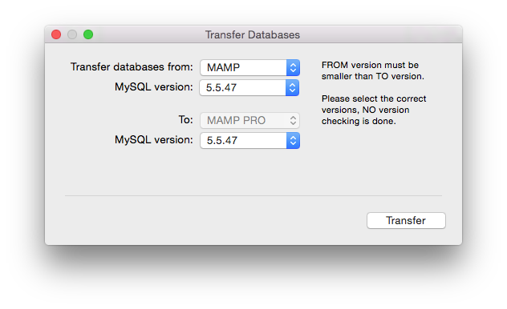

## Tools

*  **Start/Stop Servers:**

Start and start the active servers.

*  **Web Start:**

---

*  **Extras:**
     Go directly to the Extras pane of the last selected host.

---

*  **Verify MySQL Databases:**
     Get a complete list of schemas and tables inside of your MySQL Database. The database must be running in order for this      function to work.

*  **Repair MySQL Databases:**
      Runs mysqlcheck which performs table maintenance.

 
*  **Update MySQL Databases:**
     Update your databases. The server must be shutdown to use this function.

 
*  **Save MySQL Databases:**
     Make a backup of your databases. The server must be shutdown to use this function.

---

*  **Transfer MySQL Databases:**

     When tranferring databases ...
      
      
     
      
     You can only transfer to a higher version ...

---

*  **Show Hosts File:**
     The hosts file is located in the /etc directory, it maps host names to the IP address of your Mac. The host file            contains the host names. Host entries created by MAMP PRO are marked by “# MAMP PRO - Do NOT remove this entry!”. These      will disappear when Apache is shut down.

*  **Start System Apache / Web Sharing:**
     Enable the Apache server that is included with Mac OS X.

