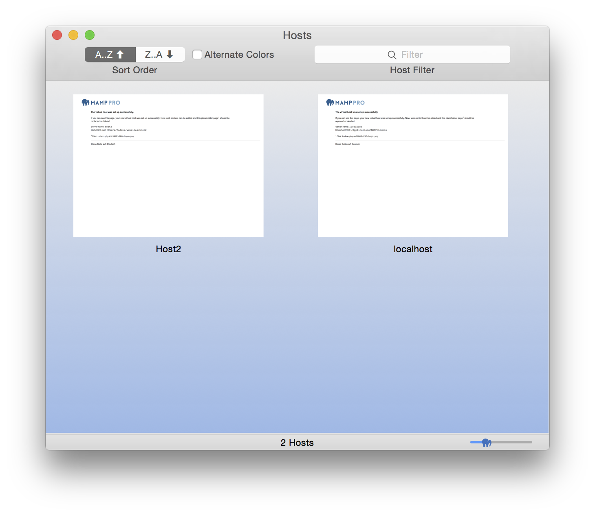
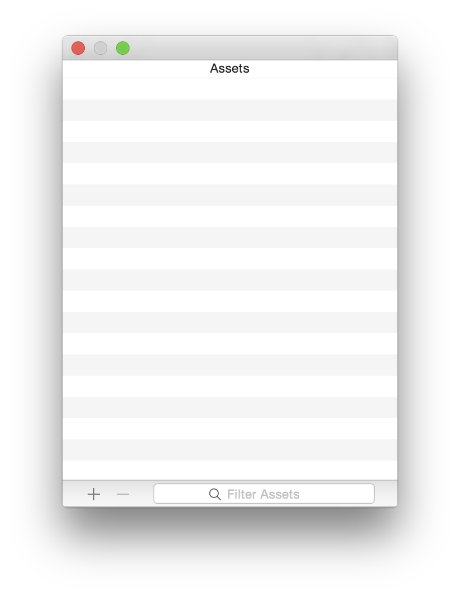

##  Window

### Overview

Overview allows quick access to preview websites. Overview can be added to the toolbar.

---

### Assets

Track your assets using the Asset Manager. The Asset Manager can be added to the toolbar.
  

---

### Scrap Pad

Use your scrap pad to paste notes or code for later use. The Scrap Pad can be added to the toolbar.

---

### Summary

Summary provides a summary of your MAMP PRO setup, including all individual host settings.
