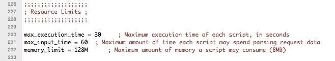

## Menu

### MAMP PRO

#### Check For Updates

Check MAMP PRO updates checks for updates to the MAMP PRO application. It does not check for new versions of individual components.

---

#### About MAMP PRO

Check your version number and MAMP PRO key.

---

#### Preferences…

*  **Open WebStart when starting MAMP PRO:**
     Your default browser will bring up the web start page when MAMP PRO is launched.

*  **Path To Webstart:**
     The default MAMP start page provides links to access utilities such as phpMyAdmin, phpInfo, SQLite Manager,       phpLiteAdmin, FAQ, and the MAMP Website.

---

When left using the default setting (`/MAMP/`), you will be directed to the MAMP PRO utilities start page using the Alias definition `/MAMP/`. If this field is left blank, you will be taken to your default document root (http://localhost:8888 in the `/Applications/MAMP/htdocs`). If you enter /subDirectory in this field, you will be taken to the `/Applications/MAMP/htdocs/subDirectory` folder via your default web browser (http://localhost:8888/subDirectory).

 

*  **Allow Saving when Document Root is invalid:**
     MAMP PRO will ignore invalid paths to hosts and proceed with saving your settings.

--- 

*  **Allow Saving when IP Address is invalid:**
     MAMP PRO will ignore invalid IP addresses for hosts and proceed with saving your settings.

     

     Note: Setting these options may prevent Apache from starting up.
     

*  **Automatically Restart Servers if necessary (don’t ask):**
     MAMP PRO will automatically restart when changes are made that require a restart.

---

*  **Keyboard shortcut for MAMP:**
Only M cannot be used as a shortcut key. The ^ key stands for the ctrl key.

*  **Show Status in Menu Bar:**
     The elephant icon will appear in the Menu Bar. When MAMP PRO has the servers running the elephant icon will be blue,         when the servers are not running the elephant will be black.

*  **Hide Doc Icon:**
     The Doc Icon will be hidden. This option will only take affect after the restart of MAMP PRO.

     

     Note: You will not be able to see the MAMP PRO Menu Bar.
     

*  **Use Message Center (OS X 10.9 or later):**
     The Message Center will inform you of when Apache and MySQL have started. The Message Center can only be used when the       doc icon is hidden.

---

*  **Automatically Check For Updates:**
     You will be notified when a new MAMP PRO update is available. 

---

### File

*  **Edit Template:**
     MAMP PRO uses templates to create the necessary server config files. You can edit these templates from the menu item        File > Edit template. Here, you have access to options which are not accessible from the MAMP PRO user interface.

     

     Note: Edition errors in the templates of the configuration files can cause the servers not to start. This could mean        that you will have to reset the settings for MAMP PRO, and you may lose all your other custom settings. You should edit      these templates only if you are familiar with the exact syntax and meaning of the options.
     

     
     *Apache (httpd.conf and httpd-ssl.conf)*
     
     Open and edit your httd.conf template file here. Changes made to your template file will be reflected your         real      httpd.conf file. The httpd.conf file created from the template file and is located in `/Library/appsolute/MAMP              PRO/conf`. You can check this file to verify changes you are making in your template file are properly reflected.
     

     Changes are reflected in your real httpd.conf file after your servers are restarted. This applies to all                    configuration files including nginx.conf, php.ini, my.cnf and main.cnf.
     

     
     *Nginx (nginx.conf)*
     
     Open and edit your nginx.conf template file here. Changes made to your template file will be reflected your                 real nginx.conf file. The nginx.conf file created from the template file and is located in `/Library/appsolute/MAMP         PRO/conf`.
     
     *PHP (php.ini)*
     
     Open and edit your php.ini template file here. There are likely several versions of php available, each of them with        their own template file. Changes made to your template file will be reflected your real php.ini file. The php.ini file      created from the template file and is located in `/Library/appsolute/MAMP PRO/conf`.
     
     
     
     *MySQL(my.cnf)*
     
     Open and edit your my.cnf template file here. There are likely several versions of MySQL available, each of them with       their own template file. Changes made to your template file will be reflected your real my.cnf file. The my.cnf file        created from the template file and is located in `/Library/appsolute/MAMP PRO/conf`.
     
     *Postfix (main.cf)*
     
     Open and edit your main.cnf template file here. There are likely several versions of MySQL available, each of them with      their own template file. Changes made to your template file will be reflected your real main.cnf file. The main.cnf         file created from the template file and is located in `/Library/appsolute/MAMP PRO/conf`.
     
---

*  **Factory Settings:**
     Development

     Development will reset all your host and server settings back to default, including setting your Apache ports back to       8888, 8890, 8889, and your Apache User/MySQL User to username/username.

*  **Live:**
     Live will reset all your host and server settings back to default, including setting your ports back to 80, 440, 3306,      and your Apache User/MySQL User to www/mysql.

*  **Backup…:**
     Make a backup of all your host settings and database files.
     
     

     Note: The backup feature makes a backup of your current host settings. It will not back up the files(.php, .html, .js       etc…) in a hosts document root! 
     Restore From Backup
     

     
*  **Restore your host settings and MySQL database files.:**

---

### Log

The MAMP server record events like errors in so-called log files. Use the MAMP PRO menu to display the content of these files.

---

### Tools

*  **Extras:**
     Go directly to the Extras pane of the last selected host.

---

*  **Verify MySQL Databases:**
     Get a complete list of schemas and tables inside of your MySQL Database. The database must be running in order for this      function to work.

*  **Repair MySQL Databases:**
      Runs mysqlcheck which performs table maintenance.

 
*  **Update MySQL Databases:**
     Update your databases. The server must be shutdown to use this function.

 
*  **Save MySQL Databases:**
     Make a backup of your databases. The server must be shutdown to use this function.

 
*  **Show Hosts File:**
     The hosts file is located in the /etc directory, it maps host names to the IP address of your Mac. The host file            contains the host names. Host entries created by MAMP PRO are marked by “# MAMP PRO - Do NOT remove this entry!”. These      will disappear when Apache is shut down.

*  **Start System Apache / Web Sharing:**
     Enable the Apache server that is included with Mac OS X.
